# Self Service DSL

NCM Self-Service DSL หมายถึง Domain-Specific Language (DSL) ที่ใช้ใน NCM Self-Service (เดิมชื่อ Calm) ซึ่งเป็นแพลตฟอร์ม application management. DSL เป็นภาษาโปรแกรมเฉพาะทางที่อิงตาม Python ซึ่งช่วยให้ผู้ใช้สามารถกำหนดและ automate tasks รวมถึง application workflows ภายใน infrastructure as code (IaC) ได้. นอกจากนี้ยังรองรับการรันคำสั่ง CLI ซึ่งช่วยเพิ่มขีดความสามารถให้ผู้ใช้โต้ตอบและใช้งานฟีเจอร์และฟังก์ชันของ Self-Service ได้อย่างสะดวก มีประสิทธิภาพ และเป็นแบบอัตโนมัติ.

ต่อไปนี้คือตัวอย่างเฉพาะของวิธีที่คุณสามารถใช้ DSL เพื่อดำเนินการสำคัญบางอย่างภายใน NCM Self-Service:

-   **Create App Blueprints**: คุณสามารถใช้ NCM Self-Service DSL เพื่อสร้าง Blueprint ที่กำหนด web server application. Blueprint สามารถกำหนด VM ที่ application จะรัน, operating system ที่ VM จะใช้, และ software (packages) ที่จะถูกติดตั้งบน VM ตลอดจน advanced capabilities อื่นๆ.
    
-   **Manage Applications**: NCM Self-Service DSL สามารถใช้เพื่อ deploy และจัดการ applications ผ่าน actions ต่างๆ เช่น การ start, stop, และ restart applications หรือการทำ custom Day 2 action ใดๆ.
    
-   **Automate tasks with Runbooks**: NCM Self-Service DSL สามารถใช้ในการ automate tasks ผ่าน scripts ในภาษา Python เพื่อสร้าง Runbook ซึ่งเป็น automation workflow ที่มีลำดับของ tasks ที่สามารถนำไปรันบน endpoint ใดก็ได้.
    
-   **Build Providers**: NCM Self-Service DSL สามารถนำมาใช้สร้างและบริโภค (consume) Providers ซึ่งสามารถนำไปใช้จัดการ clouds และ workloads ที่ไม่ได้รับการรองรับแบบ native. แต่ละ Provider สามารถกำหนดวิธีเชื่อมต่อกับ cloud เฉพาะ, วิธีจัดการ workloads ที่รันอยู่บนนั้น, และ advanced capabilities อื่นๆ.
    

## Overview

เพื่อเริ่มต้น Self Service Domain-Specific Language (DSL) lab, เราได้เตรียม DevWorkStation Blueprint เพื่อให้คุณเริ่มต้นได้อย่างรวดเร็ว. Blueprint ที่รวมไว้นี้จะทำการสร้าง Rocky Linux VM พร้อมกับเครื่องมือที่จำเป็นทั้งหมด.

## Add Blueprint to Marketplace

-   ดาวน์โหลด DevWorkStation Blueprint โดยคลิก [ที่นี่](DevWorkstation.json).
    
-   ดาวน์โหลดไอคอนของ DevWorkStation Blueprint สำหรับ Market Place โดยคลิก [ที่นี่](software-developer.png).
    

### Upload Blueprint to Marketplace

1.  ภายใน Prism Central, คลิกที่ **App switcher** และเลือก **Self Service**

    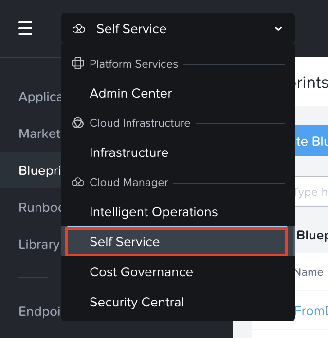

2.  เลือก **Blueprints** จากเมนูด้านซ้ายและคลิก **Upload Blueprint**. เลือก **DevWorkStation.json**.
    
3.  ปรับเปลี่ยน **Blueprint Name** เป็น `User##`\-DevWorkStation. แม้ว่าจะอยู่ข้ามโปรเจกต์ (projects) อื่นๆ ชื่อของ Calm Blueprint จะต้องไม่ซ้ำกัน (unique).
    
4.  จากเมนูแบบเลื่อนลงของ _Project_, ให้เลือก `User##`\-Project และคลิก **Continue**.
    
    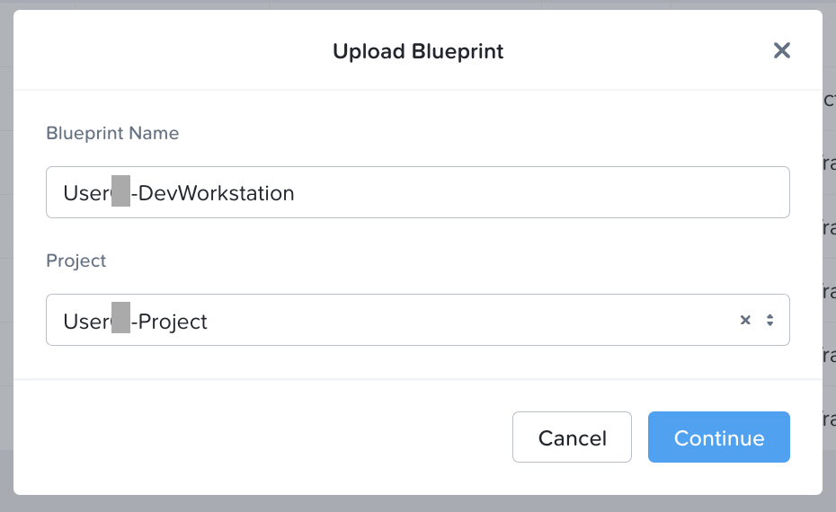

5.  ภายในหน้า Blueprint Settings, ทำการอัปเดตชื่อและ Environment ของ Blueprint ให้ตรงกับ User## ของคุณ และคลิกที่ **VM Details**. 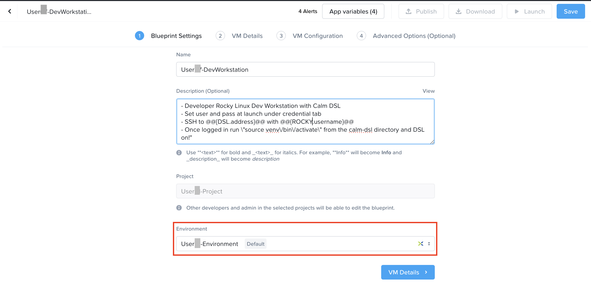
    
6.  คลิกที่ **VM Configuration** เพื่อดำเนินการต่อ. 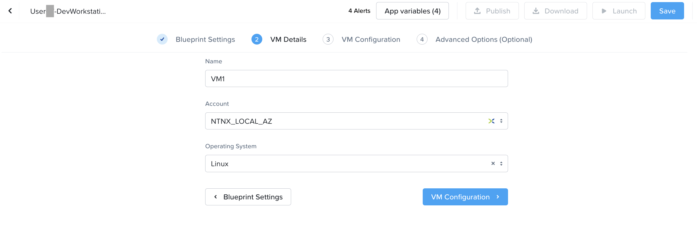
    
7.  คลิกที่ **Clone from environment** และเลื่อนลงไปที่ **Guest Customization**. ที่นั่นคุณจะพบ script ต่อไปนี้ (วางลงไปหากไม่มีอยู่):
    

    ```
    #cloud-config
    hostname: Calm-DSL-@@{calm_unique}@@
    manage_etc_hosts: true
    ssh_pwauth: True

    users:
    - name: @@{ROCKY.username}@@
        sudo: ['ALL=(ALL) NOPASSWD:ALL']
        shell: /bin/bash
    chpasswd:
    list: |
        @@{ROCKY.username}@@:@@{ROCKY.secret}@@
    expire: False

    runcmd:
    - exec > /var/log/calm_dsl_install.log 2>&1

    # Update and install dependencies
    - sudo dnf -y update
    - sudo dnf -y install git gcc openssl-devel python3 python3-pip python3-devel jq make

    # Clone Calm DSL (latest stable release)
    - cd /home/@@{ROCKY.username}@@ && git clone --branch v4.1.0 https://github.com/nutanix/calm-dsl.git
    - sudo chown -R @@{ROCKY.username}@@:@@{ROCKY.username}@@ /home/@@{ROCKY.username}@@/calm-dsl

    # Build Calm DSL
    - cd /home/@@{ROCKY.username}@@/calm-dsl && sudo -u @@{ROCKY.username}@@ bash -c "make dev"

    # Optional: Initialize Calm DSL (safe quoting for password)
    - sudo -u @@{ROCKY.username}@@ bash -c "
        source /home/@@{ROCKY.username}@@/calm-dsl/venv/bin/activate &&
        calm init dsl -i @@{prism_central_ip}@@ -P @@{prism_central_port}@@ \
            -u @@{prism_central_user}@@ -p '@@{prism_central_password}@@' \
            -pj @@{calm_project_name}@@ &&
        calm init bp
        "
    ```

8.  เลื่อนลงไปยังส่วนของ _DISKS (1)_. จากเมนูแบบเลื่อนลงของ _Image_, ตรวจสอบให้แน่ใจว่าเลือกภาพ **Rocky9.qcow2** แล้ว. โปรดทราบว่าการตั้งค่า VM เหล่านี้ได้รับการสืบทอด (inherited) มาจากสิ่งที่เราตั้งไว้ในการตั้งค่า Environment สำหรับ Linux VM.
    
    !!! warning
        อาจมีหลาย images บนคลัสเตอร์ ดังนั้นการเผลอเลือก image อื่นจึงเกิดขึ้นได้ง่าย. โปรดตรวจสอบให้แน่ใจว่าคุณได้เลือก image **Rocky9.qcow2**.
    
9.  คลิก **Save** จากนั้นคลิก **Advanced Options** เพื่อกำหนดค่า credentials. 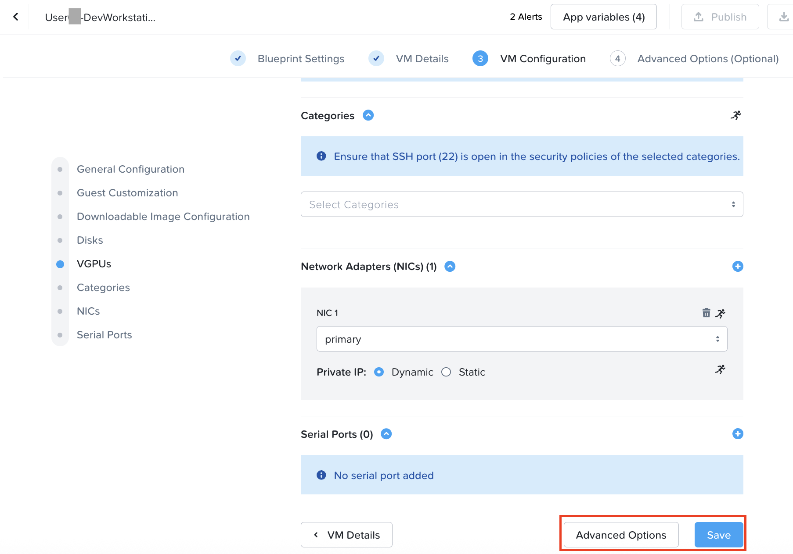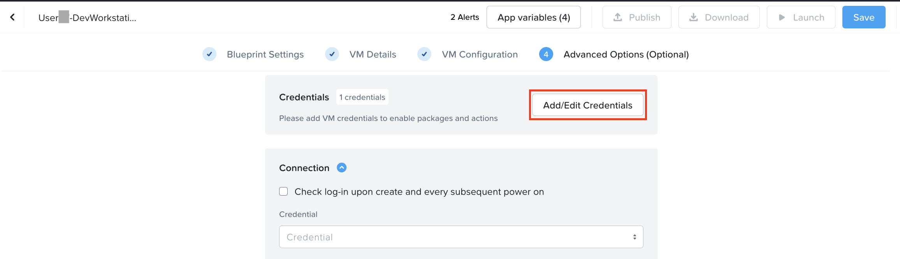
    
10.  ภายในหน้า **Credentials(1)** ตรวจสอบให้แน่ใจว่ามี credential ที่ชื่อ **ROCKY** พร้อมการกำหนดค่าต่อไปนี้ และคลิก **Done**:
    
    -   **Name** - **ROCKY**
    -   **Type** - **Static**
    -   **Username** - **rocky**
    -   **Secret Type** - **Password**
    -   **Password** - **nutanix/4u**
    
    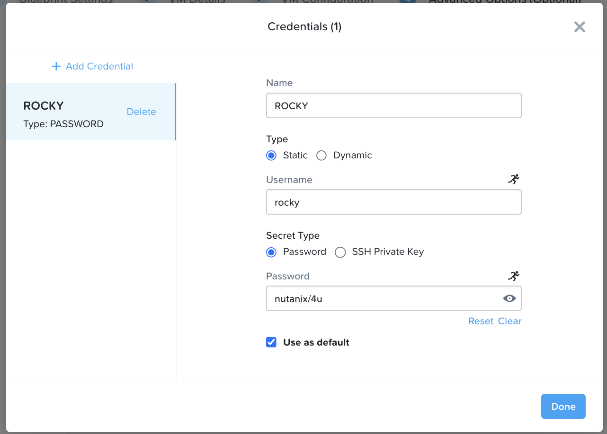

11.  เลื่อนลงมาและคลิก **Save** ภายใน _Advanced Options (Optional)_.
    

เป็นเรื่องปกติที่จะมีคำเตือนเดียวเกี่ยวกับการที่ตัวแปร `prism_central_password` ว่างเปล่า. เราจะแก้ไขปัญหานี้ในส่วนถัดไป. หากคุณมี error อื่นๆ, โปรดแก้ไขก่อนดำเนินการต่อไปในส่วนถัดไป.

### Publishing the Blueprint

1.  คลิกที่ปุ่ม **Publish** และกรอกข้อมูลต่อไปนี้:
    
    -   **Name** - `User##`\-DevWorkStation
    -   **Initial Version** - 1.0.0
    -   **Change Image** - คลิก **Change > Upload from computer** เลือก _software-developer.png_ และคลิก **Open**. ป้อน **Workstation** เป็นชื่อไอคอน. คลิกและคลิก **Select & continue**.
2.  คลิก **Submit for Approval**.
    
    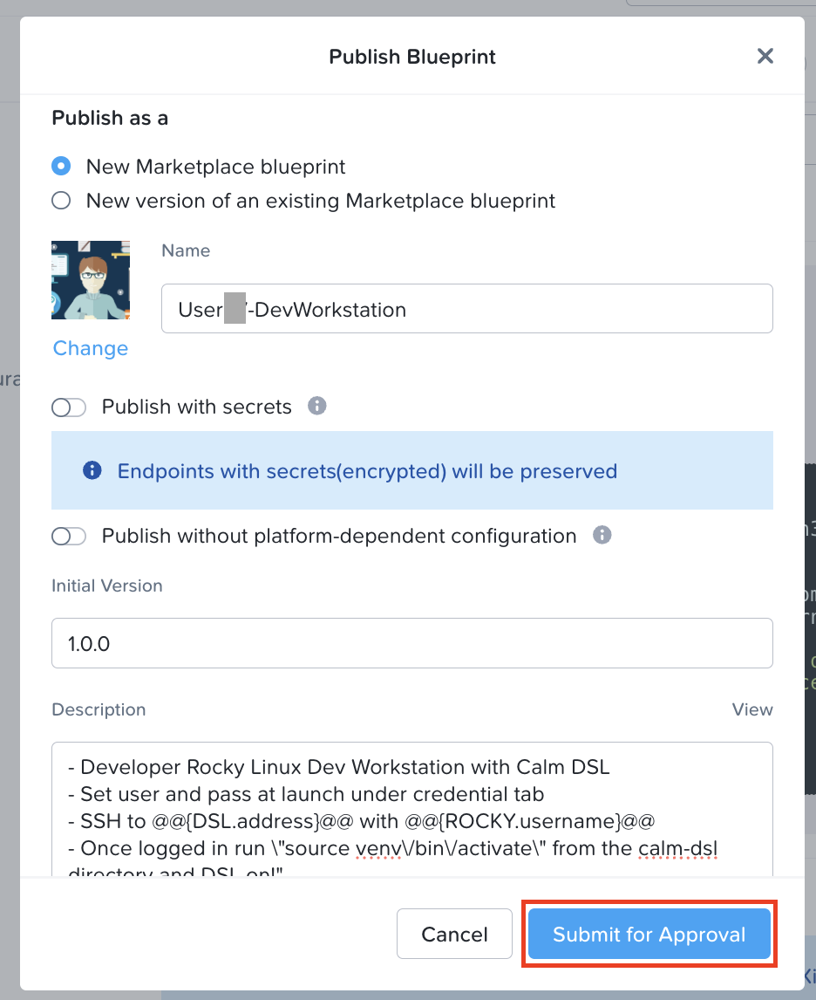

### Approving Blueprints

1.  เลือก 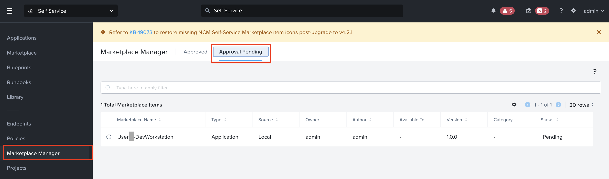 **Marketplace Manager** จากเมนูด้านซ้ายเพื่อดูและจัดการ Marketplace Blueprints.
    
2.  คุณจะเห็นรายชื่อของ Marketplace Blueprints และเวอร์ชันของพวกมันที่ระบุไว้. จากเมนูด้านบน ให้เลือก **Approval Pending**.
    
3.  คลิกที่ไอเท็ม `User##`\-**DevWorkStation** Marketplace ของคุณ.
    
4.  เลือก `User##`\-Project ภายในเมนูแบบเลื่อนลงของ _Projects Shared With_.
    
5.  คลิกเพื่อ approve ตัว Blueprint.
    
    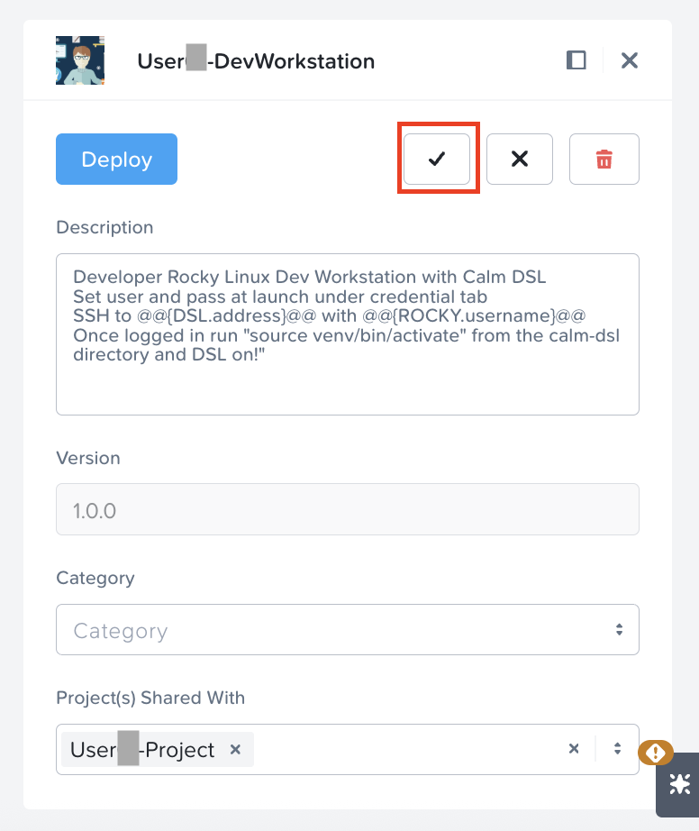
    
6.  จากเมนูด้านบน เลือก **Approved**. เลือก blueprint ของคุณแล้วคลิกปุ่ม **Publish** เพื่อให้เป็นสาธารณะ (public) บน **Self Service Marketplace**. 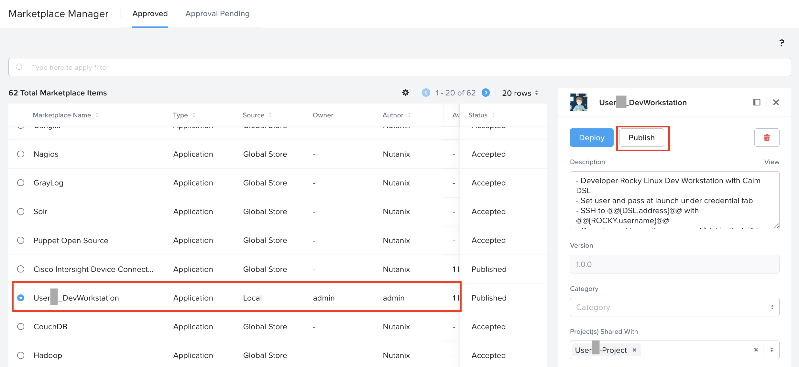
    

## Deploy DevWorkstation from the Marketplace

1.  ภายใน Prism Central, คลิกที่ **App switcher** และเลือก **Self Service** (หากยังไม่ได้อยู่ในหน้านี้)

    

2.  เลือก **Marketplace** จากเมนูด้านซ้าย

    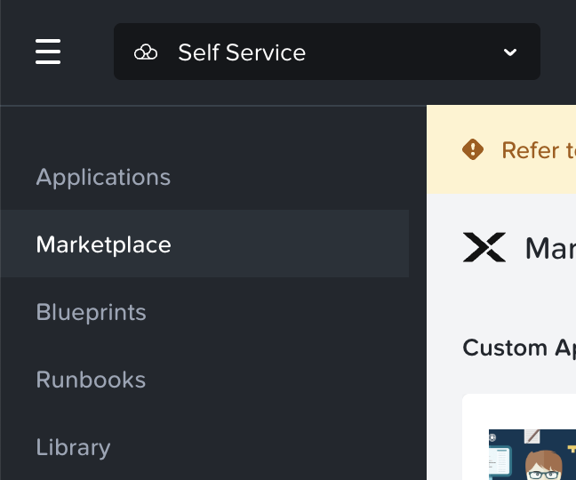

3.  เลื่อนดูในหน้า Marketplace เพื่อค้นหา Dev Workstation catalog item และเลือก **Get**.

    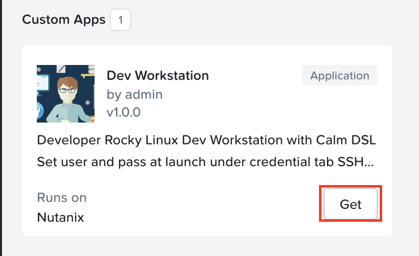

4.  ตอนนี้ให้เลือก **Deploy**

    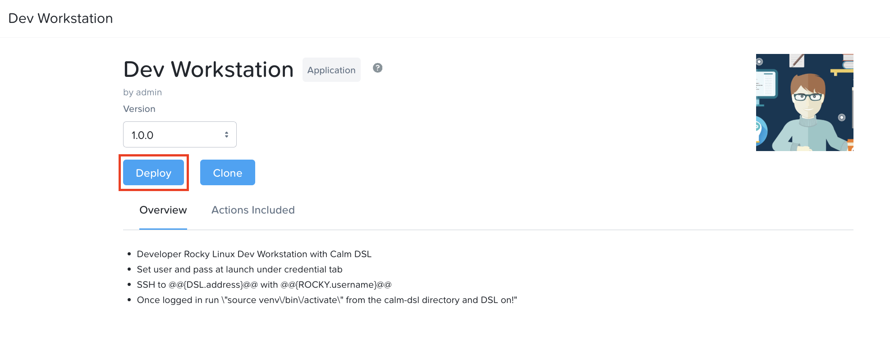

5.  กรอกข้อมูลในฟิลด์บนฟอร์มตามลำดับ:
    
    -   **Application Name** - `User##`\-DevWorkstation
    -   เลือก `User##`\-Project ของคุณจาก project dropdown
    -   เลือก `User##`\-Environment ของคุณจาก Environment dropdown
    -   ป้อน **Prism Central IP** สำหรับ lab ของคุณในส่วนของ variables
    -   ป้อน **Prism Central Pasword** สำหรับ lab ของคุณในส่วนของ variables

    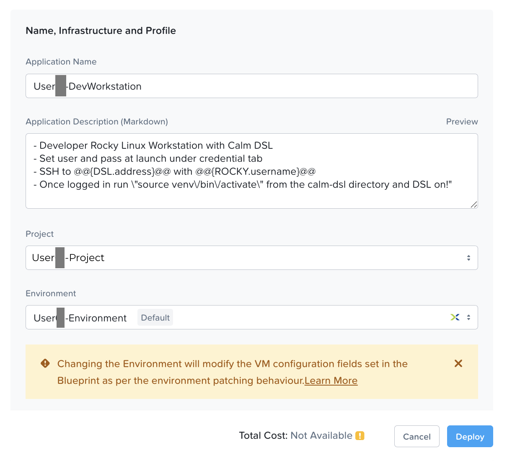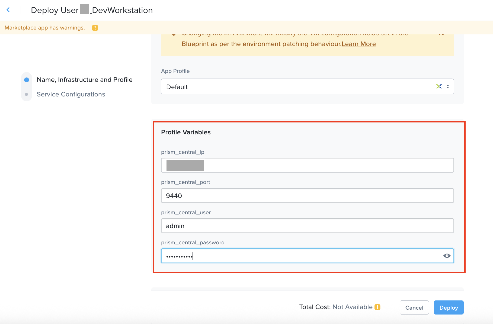

6.  คลิก **Deploy**
    
7.  คุณสามารถคลิก **View in Applications** จากกล่องโต้ตอบ (dialog box) **Deploying App** เพื่อมอนิเตอร์การ deploy ของ `DevWorkstation`.
    

    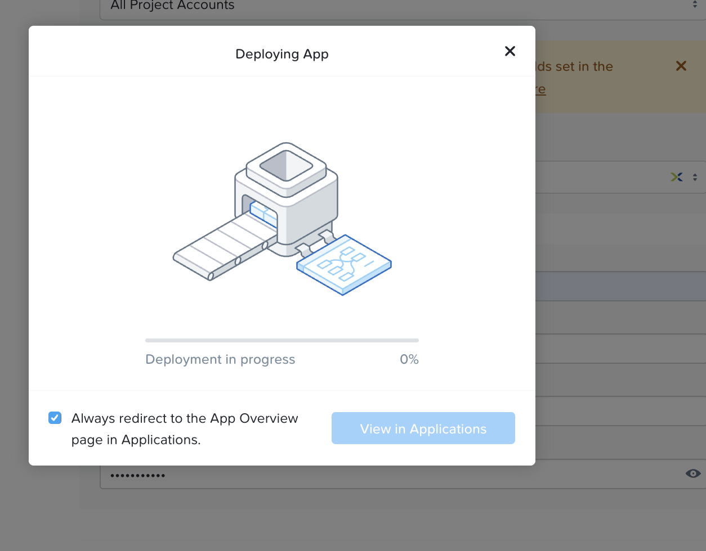

    ```
    ::: tip Note
    ขอแนะนำให้ตรวจสอบ audit log เพื่อดู packages ที่กำลังทำการ deploy. การ deploy จะใช้เวลาประมาณห้านาที.
    :::
    ```

8.  เมื่อ application (deployment) เสร็จสิ้น, สถานะจะเปลี่ยนจาก **Provisioning** เป็น **Running**

    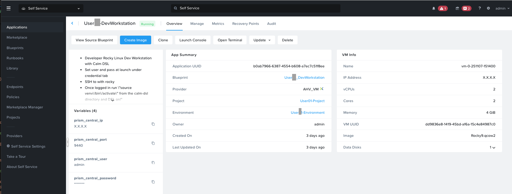

## Using Self Service DSL

1.  จากมุมมอง **Application** ปัจจุบัน, ให้คลิกที่ **Open Terminal** จากบานหน้าต่างด้านขวา. Application อาจจะแสดงผลเป็น running แล้ว, แต่ cloud-init script อาจจะยังรันอยู่, ดังนั้นไฟล์ Calm DSL จึงอาจยังไม่ปรากฏขึ้น. เพื่อตรวจสอบ คุณสามารถรันคำสั่ง **sudo cloud-init status** ภายใน terminal เพื่อดูสถานะ.

    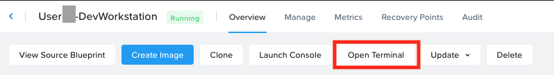

    ```
    ::: tip Note

    หากคุณต้องการใช้ SSH, เมื่อ application อยู่ในสถานะ *Running* แล้วให้จด IP address ไว้. มันจะถูกระบุอยู่ใน application overview. จากนั้นคุณสามารถ SSH ไปที่ IP นั้นโดยใช้ username `centos` และ password `nutanix/4u`.

    :::
    ```

2.  เปลี่ยน directories โดยการพิมพ์ `cd calm-dsl` แล้วกด `enter`.
    
    !!! note
        หากคุณยังไม่เห็น directory สำหรับ calm-dsl, ให้รอหนึ่งหรือสองนาทีเนื่องจากการติดตั้งอาจยังดำเนินการอยู่.
    
3.  รัน `source venv/bin/activate` เพื่อสลับไปยัง virtual environment ภายใน Self Service DSL.
    
    !!! note
        แม้จะดำเนินการผ่าน Blueprint ไปแล้ว, คุณสามารถตั้งค่าการเชื่อมต่อไปยัง Prism Central ผ่านคำสั่ง `calm init dsl` ได้.
    
4.  ตอนนี้เราจะเชื่อมต่อ Dev Workstation เข้ากับ Self Service instance ใน lab.
    
    -   พิมพ์ `calm init dsl` และกรอกข้อมูลที่ร้องขอ
    -   Prism Central IP:
    -   Port: **9440**
    -   Username: `adminuser##`@ntnxlab.local
    -   Password: **provided password**
    -   Project: `User##`\-Project

5.  ตรวจสอบการตั้งค่า config ปัจจุบันโดยรัน `calm show config`.
    
    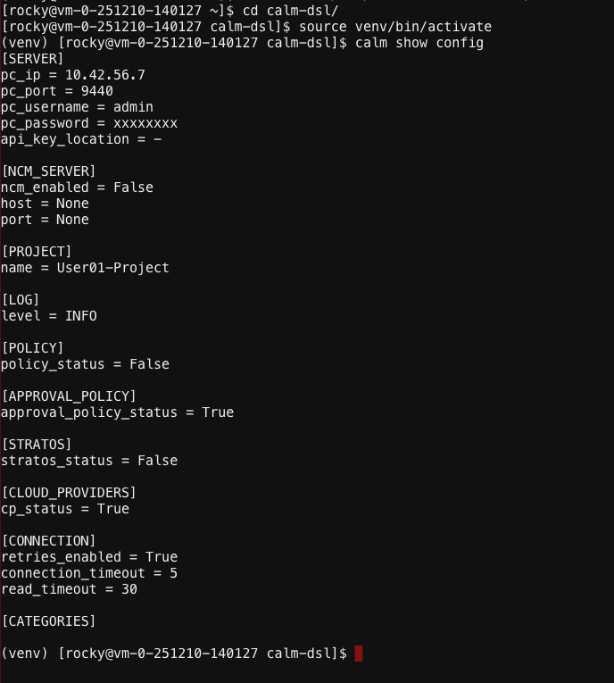

### List the current Blueprints in Self Service

1.  รัน `calm get bps`, แล้วเราจะเห็น Blueprints ทั้งหมดใน Self Service พร้อมด้วย UUID, description, application count, project, และ state.
    
    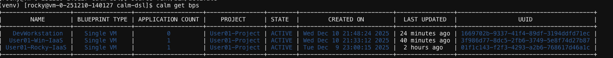
    
2.  รัน `calm get bps -q` เพื่อแสดงผลแบบ _quiet_ โดยมีเฉพาะชื่อของ Blueprint.
    
    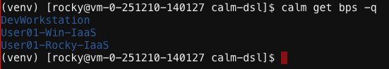
    

### Review and Modify a Blueprint

ตอนนี้มาทบทวน Python-based Blueprint กัน แล้วทำการแก้ไข (modify).

1.  เริ่ม (Initialize) blueprint ใหม่โดยรันคำสั่งต่อไปนี้:
    
    ```
    calm init bp
    ```
    
2.  เปลี่ยนไปยัง directory _HelloBlueprint_ โดยรันคำสั่ง `cd HelloBlueprint`, ตามด้วยคำสั่ง `ls`.
    
3.  Directory _HelloBlueprint_ มีไฟล์ที่เรียกว่า _blueprint.py_, ซึ่งเป็น Python Blueprint. นอกจากนี้ยังมี directory _scripts_ ที่เก็บ scripts ที่ถูกอ้างอิงภายใน Blueprint.
    
    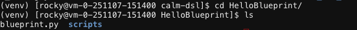

#### Modify blueprint.py

1.  ก่อนที่เราจะแก้ไข (modify), มาทำการคัดลอกไฟล์ _blueprint.py_ โดยใช้คำสั่ง `cp blueprint.py blueprint.py.bak` กัน.
    
    !!! note
        หากคุณแก้ไขผิดพลาด, คุณสามารถออกจากไฟล์ได้ตลอดเวลาโดยไม่ต้องบันทึก (save). กด **ESC** เพื่อให้แน่ใจว่าคุณไม่ได้อยู่ในโหมด _Insert_, แล้วพิมพ์ `:q!`. คำสั่งนี้จะเป็นการบังคับออกโดยไม่บันทึก. ยิ่งรู้ยิ่งดี!
    
2.  รันคำสั่ง `vi blueprint.py` เพื่อแก้ไขไฟล์ blueprint.py.
    
3.  ตรวจสอบ (Review) Blueprint สำหรับโครงสร้างที่คุ้นเคย. เพื่อข้ามไปที่บรรทัดนั้นโดยตรง ให้พิมพ์ `:<LINE#>` (ตัวอย่างเช่น :59)
    
    -   Credentials (บรรทัด 59-65)
    -   OS Image (บรรทัด 67-80)
    -   ไปที่บรรทัด 70, พิมพ์ `I` เพื่อเข้าสู่โหมด insert
    -   อัปเดตค่า VM\_DISK\_IMAGE ให้เป็น `Rocky9.qcow2`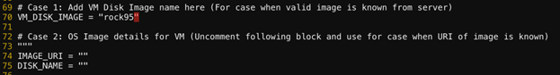
    -   ภายใต้คลาส (class) HelloPackage(Package) คุณจะเห็นการอ้างอิงถึง script `pkg_install_task.sh` ใน directory ของ scripts (บรรทัด 150)
    -   ข้อมูล Basic VM spec (vCPU/memory/disks/nics) (บรรทัด 164-170)
    -   Guest Customization ที่ประกอบด้วย cloud-init (บรรทัด 174-184)

4.  กดปุ่ม **Insert** เพื่อเข้าสู่โหมด _Insert_. ในบรรทัดที่ 165 ให้แก้ไขจำนวน vCPU จาก **2** เป็น **4**.
    
    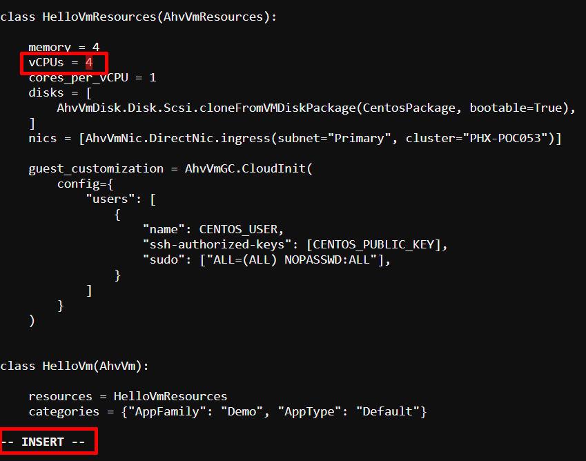
    
5.  กด **ESC** เพื่อออกจากโหมด _Insert_ และไปที่บรรทัด 198 โดยพิมพ์ `:198`. เข้าสู่โหมด _Insert_ และเพิ่ม VM name ที่ไม่ซ้ำกันโดยใช้ macro ทันทีหลังจากบรรทัด `provider_spec = HelloVm`.
    
    -   `provider_spec.name = "User##-@@{calm_unique}@@"` (เช่น User01-@@{calm\_unique}@@)
        
    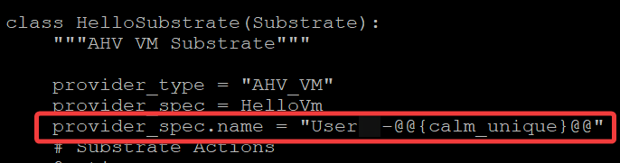
        
6.  กด **ESC** เพื่อออกจากโหมด _Insert_. บันทึก (write) ไฟล์ blueprint.py แล้วออกโดยการพิมพ์คำสั่ง `:wq`.
    

#### Modify pkg\_install\_task.sh

1.  เปลี่ยนไปที่ directory _scripts_ โดยรันคำสั่ง `cd scripts`, ตามด้วยคำสั่ง `ls`.
    
2.  รันคำสั่ง `cat pkg_install_task.sh` เพื่อดูเนื้อหาปัจจุบันของ install script. script นี้ทำหน้าที่อะไร?
    
    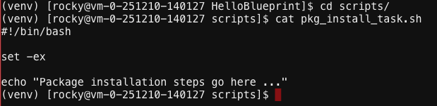
    
3.  รันคำสั่ง `curl -Sks https://bootcamps.nutanix.com/self-service/nginx > pkg_install_task.sh` เพื่อแทนที่ (replace) install script ที่มีอยู่.
    
4.  รันคำสั่ง `cat pkg_install_task.sh` อีกครั้งเพื่อดู script ที่ถูกแทนที่. ตอนนี้ script ทำหน้าที่อะไร?
    

    ```
    #!/bin/bash
    set -euo pipefail
    IFS=$'\n\t'

    # --- sanity checks ---
    if ! command -v dnf >/dev/null 2>&1; then
    echo "This script is for Rocky Linux (dnf-based)." >&2
    exit 1
    fi

    # --- repos: EPEL + Remi for modern PHP ---
    sudo dnf -y install epel-release
    sudo dnf -y install "https://rpms.remirepo.net/enterprise/remi-release-$(rpm -E %rhel).rpm"

    # Use PHP 8.2 from Remi (adjust if you prefer 8.1/8.3)
    sudo dnf -y module reset php
    sudo dnf -y module enable php:remi-8.2

    # --- install packages ---
    sudo dnf -y install nginx php-fpm php-cli php-mysqlnd php-mbstring php-xml php-opcache php-gd git unzip wget policycoreutils-python-utils

    # --- configure php-fpm (socket is default) ---
    # default pool is 'www' and listens on /run/php-fpm/www.sock in Rocky; nothing to change
    sudo systemctl enable php-fpm

    # --- nginx vhost for a Laravel-style app ---
    sudo install -d -m 0755 /var/www/laravel/public
    sudo tee /etc/nginx/conf.d/laravel.conf >/dev/null <<'NGINX'
    server {
        listen 80 default_server;
        listen [::]:80 default_server;
        server_name _;
        root /var/www/laravel/public;
        index index.php index.html;

        location / {
            try_files $uri $uri/ /index.php?$query_string;
        }

        location ~ \.php$ {
            include fastcgi_params;
            fastcgi_param SCRIPT_FILENAME $document_root$fastcgi_script_name;
            fastcgi_pass unix:/run/php-fpm/www.sock;
            fastcgi_index index.php;
        }

        location ~* \.(?:css|js|jpg|jpeg|gif|png|svg|ico|woff2?)$ {
            try_files $uri =404;
            access_log off;
            expires 30d;
        }
    }
    NGINX

    # ensure the default server block in /etc/nginx/nginx.conf doesn't conflict
    sudo sed -i 's|^ *#\? *include /etc/nginx/conf\.d/\*\.conf;|    include /etc/nginx/conf.d/*.conf;|' /etc/nginx/nginx.conf

    # --- selinux: allow nginx/php-fpm to read/write your app as needed ---
    # minimal read perms:
    sudo chcon -R -t httpd_sys_content_t /var/www/laravel
    # if your app writes to storage/, uncomment the next two lines:
    sudo install -d -m 0775 /var/www/laravel/storage /var/www/laravel/bootstrap/cache
    sudo chcon -R -t httpd_sys_rw_content_t /var/www/laravel/storage /var/www/laravel/bootstrap/cache

    # allow outbound network (e.g., if PHP needs to call APIs)
    sudo setsebool -P httpd_can_network_connect on

    # --- firewall: open http ---
    if systemctl is-active --quiet firewalld; then
    sudo firewall-cmd --add-service=http --permanent
    sudo firewall-cmd --reload
    fi

    # --- sample index page ---
    sudo wget -qO /var/www/laravel/public/index.html \
    https://raw.githubusercontent.com/bmp-ntnx/prep/master/index.html || \
    echo "<h1>Laravel-style NGINX/PHP test</h1>" | sudo tee /var/www/laravel/public/index.html >/dev/null

    # --- permissions: owned by nginx group, readable; write dirs already handled above ---
    sudo chgrp -R nginx /var/www/laravel
    sudo find /var/www/laravel -type d -exec chmod 0755 {} \;
    sudo find /var/www/laravel -type f -exec chmod 0644 {} \;

    # --- start services ---
    sudo systemctl enable --now nginx
    sudo systemctl restart php-fpm
    sudo systemctl reload nginx

    echo "NGINX + PHP-FPM installed and configured on Rocky. Visit http://<server-ip>/"
    ```

### Upload The Modified Blueprint To Self Service

1.  รันคำสั่ง `cd ~/calm-dsl/HelloBlueprint` เพื่อกลับไปยัง directory _HelloBlueprint_.
    
2.  รัน `calm create bp --file blueprint.py --name FromDSL-User##` (เช่น FromDSL-User01), ซึ่งจะทำการแปลงไฟล์ .py เป็นไฟล์ .json และอัปโหลดขึ้นไปยัง Calm.
    
    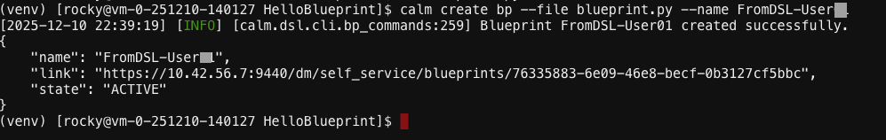
    
3.  (ตัวเลือกเสริม) รันคำสั่ง `calm compile bp -f blueprint.py` เพื่อดู Python Blueprint ในรูปแบบ json ภายใน DSL.
    
4.  ตรวจสอบว่า Blueprint ใหม่ของคุณถูกอัปโหลดสำเร็จแล้วโดยรันคำสั่ง `calm get bps -q | grep FromDSL-User##`. (เช่น FromDSL-User01)
    
    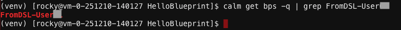
    

### Launch Your Newly Uploaded Blueprint

1.  รันคำสั่ง `calm get apps` เพื่อตรวจสอบ applications ปัจจุบันก่อนที่จะเปิดตัว (launch) อันใหม่ของคุณ. เลือกได้ว่าเราสามารถรันคำสั่ง `calm get apps -q` เพื่อแสดงผลแบบ _quiet_, อย่างที่เราได้ทำไปก่อนหน้านี้.
    
2.  รันคำสั่ง `calm launch bp FromDSL-User## --app_name AppFromDSL-User## -i`. (เช่น FromDSL-User01 AppFromDSL-User01)
    
    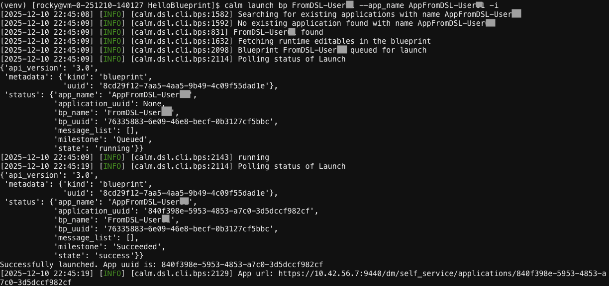
    
3.  เพื่อดูข้อมูลสรุปของ application, รันคำสั่ง `calm describe app AppFromDSL-User##` (เช่น AppFromDSL-User01). เมื่อสถานะของ app เปลี่ยนเป็น _running_, nginx server ได้ทำการ deploy เสร็จสมบูรณ์ผ่าน Calm DSL แล้ว.
    
    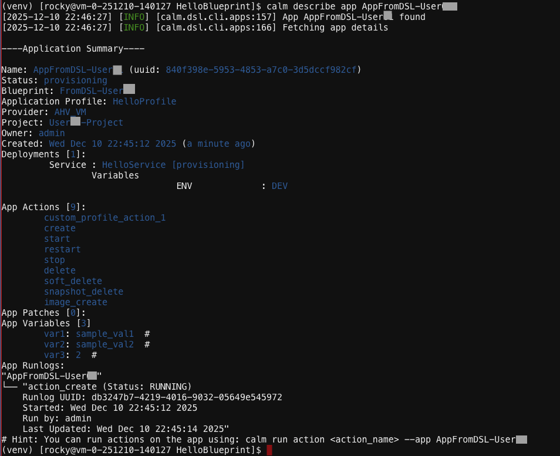
    
4.  ถัดไป เราจะรับหมายเลข IP ของ application ผ่าน _address_ จาก output json ของ application โดยรันคำสั่ง `calm describe app AppFromDSL-User## --out json | jq '.status.resources.deployment_list[].substrate_configuration.element_list[].address'`. (เช่น AppFromDSL-User01)
    
    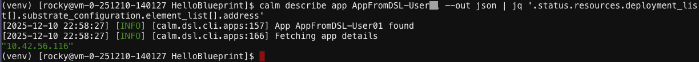
    
5.  นำ IP ที่แสดงไปป้อนลงในเว็บเบราว์เซอร์.
    
    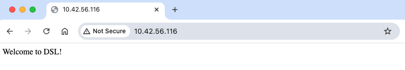
    
คุณประสบความสำเร็จในการแก้ไข (modify) Blueprint ที่มีอยู่แล้ว

## Takeaways

-   Self Service DSL ช่วยขยายความยืดหยุ่น (flexibility) โดยการผสมผสานเข้ากับเครื่องมือ Linux ที่มีอยู่ในตัว (built-in).
-   ตอนนี้คุณได้แก้ไข (edit) Blueprint, อัปโหลดไปยัง Self Service, และเปิดตัว (launch) application - ทั้งหมดทำผ่าน command line.


---

[← Back: Self Service IaaS Windows](selfservice-windows.md) | [Home](selfservice-gettingstart.md) | [Next: Glossary →](selfservice-appendix.md)