# Self Service IaaS: Linux

## Overview

Nutanix Self Service ช่วยให้คุณสามารถเลือก, provision, และจัดการ business applications ของคุณบน infrastructure ได้อย่างราบรื่นสำหรับทั้ง private และ public clouds. Self Service ให้บริการด้าน lifecycle, monitoring และ remediation เพื่อจัดการ heterogeneous infrastructure ของคุณ เช่น VMs หรือ bare-metal servers.

Infrastructure-as-a-Service (IaaS) ถูกกำหนดให้เป็นความสามารถในการจัดหา compute resources ได้อย่างรวดเร็วแบบ on-demand ผ่าน self-service portal. แม้ว่าลูกค้าหลายรายจะใช้ Nutanix Self Service เพื่อ orchestrate complex, multi-tiered applications แต่ลูกค้าส่วนใหญ่ก็ยังใช้เพื่อให้บริการ IaaS ขั้นพื้นฐานสำหรับ end users ของพวกเขาด้วย.

ใน lab นี้ คุณจะได้สร้าง _Single VM Blueprint_ โดยใช้ Linux, launch ตัว Blueprint, และจัดการ application ที่ได้.

## Creating a Single VM Blueprint

Blueprint คือ framework สำหรับทุก application หรือส่วนของ infrastructure ที่คุณ model โดยใช้ Nutanix Calm. ในขณะที่ complex, multi-tiered applications ใช้ _Multi VM/Pod Blueprint_, อินเทอร์เฟซที่ใช้งานง่ายของ _Single VM Blueprint_ นั้นเหมาะสำหรับ use cases ของ IaaS. คุณสามารถ model แต่ละประเภทของ infrastructure ที่บริษัทของคุณใช้งาน (ตัวอย่างเช่น Windows, CentOS, หรือ Ubuntu) ใน Single VM Blueprint, และ end users สามารถ launch Blueprint ซ้ำๆ เพื่อสร้าง infrastructure แบบ on demand ได้. Infrastructure ที่ได้ (ซึ่งเรียกว่า _application_) สามารถถูกจัดการได้ตลอด entire lifecycle ภายใน Calm ซึ่งรวมถึงการจัดการ Nutanix Guest Tools (NGT), การปรับเปลี่ยน resources, snapshots, และ clones.

1.  ภายใน Prism Central, เลือก drop-down **App Switcher** ที่ด้านบนและเลือก **Self Service**.
    
    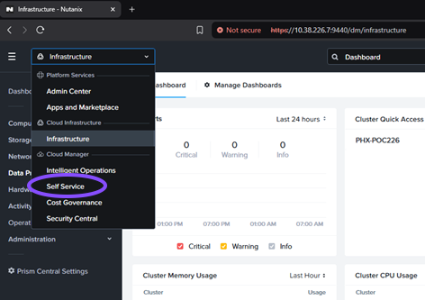
    
2.  เลือก **Blueprints** ที่แถบเมนูด้านซ้าย
    
    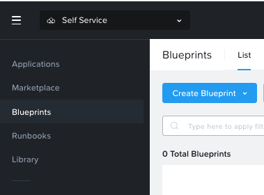
    
3.  คลิก **Create Blueprint > Single VM Blueprint**
    
    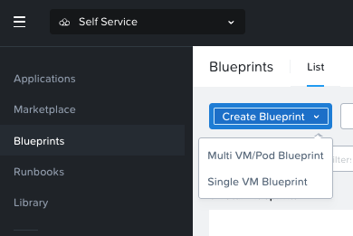
    
4.  กรอกข้อมูลในช่องต่อไปนี้:
    
    -   **Name** - `User##`-Rocky-IaaS
    -   **Project** - `User##`-Project
    -   **Environment** - `User##`-Environment
    
    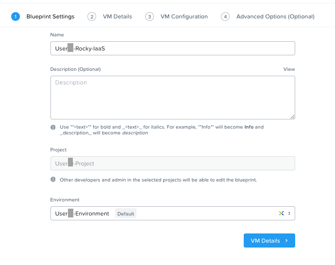
    
5.  คลิก **VM Details**.
    
6.  กรอกข้อมูลในช่องต่อไปนี้บนหน้า **VM Details**:
    
    -   **Name** - `User##`_VM
    -   **Operating System** - เลือก **Linux** จาก drop-down.
    
    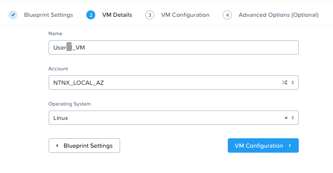
    
7.  คลิก **VM Configuration**.
    
    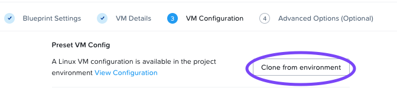
    
8.  คลิก **Clone from environment**. เนื่องจากคุณได้ระบุ details สำหรับ Linux VM ของคุณไว้ใน Project แล้ว จึงไม่จำเป็นต้องป้อนข้อมูลเดิมซ้ำอีก คุณจะ update เฉพาะช่อง VM Name และ Guest Customization ภายใต้ส่วน **General Configuration**.
    
    -   _VM Name_ - กรอก `@@{vm_name_prefix}@@-@@{calm_unique}@@` ภายในช่อง _VM Name_.
    
    สังเกตที่ `@@{vm_name_prefix}@@`. ใน Self Service ตัวอักษร `@@{` และ `}@@` เป็นตัวแทนของ macro. ในช่วง runtime, Self Service จะแทนที่ค่าที่ถูกต้องโดยอัตโนมัติเมื่อพบ macro. macro อาจจะแสดงถึง system defined value, VM property, หรือ (อย่างในกรณีนี้) เป็น runtime variable.
    
    Self Service macros เป็นส่วนหนึ่งของ templating language สำหรับ scripts ของ Self Service. สิ่งเหล่านี้จะถูก evaluate โดย execution engine ของ Self Service ก่อนที่ script อีกทำงาน.
    
    Macros ช่วยให้คุณเข้าถึง value ของ variables และ properties ที่ตั้งค่าไว้ใน entities. variables เหล่านี้สามารถเป็น user defined หรือ system generated ก็ได้. สำหรับข้อมูลเพิ่มเติม ให้ดูที่ส่วน [Macros Overview](https://portal.nutanix.com/page/documents/details?targetId=Self-Service-Admin-Operations-Guide-v4_2_1:nuc-components-macros-overview-c.html) ของ Self Service Administration and Operations Guide.
    
    -   _Guest Customization_ - Guest customization ช่วยให้สามารถปรับเปลี่ยน settings บางอย่างตอน boot ได้. Linux ใช้ _cloud-init_, ในขณะที่ Windows ใช้ _sysprep_. ทำเครื่องหมายถูกที่กล่อง **Guest Customization**, และวาง script ต่อไปนี้.
        
        ```
        #cloud-config
        users:
          - name: @@{ROCKY.username}@@
            sudo: ['ALL=(ALL) NOPASSWD:ALL']
        chpasswd:
          list: |
            rocky:@@{ROCKY.secret}@@
          expire: False
        ssh_pwauth:   true
        ```
        
        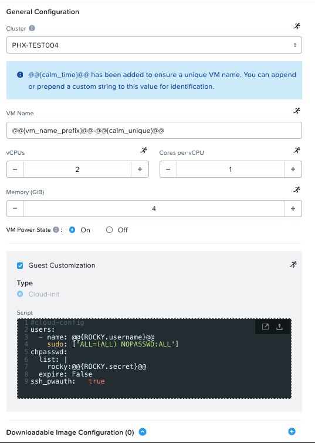
        
9.  ทบทวนข้อมูลในช่องอื่นๆ.
    
    -   _Disks_ - Disk คือ storage ของ VM หรือ infrastructure ที่เรากำลัง deploy. มันอาจจะอิงจาก pre-existing image (เหมือนในกรณีของเรา), หรืออาจจะอิงจาก blank disk เพื่อให้ VM สามารถ consume storage เพิ่มเติมได้. ตัวอย่างเช่น Microsoft SQL server อาจต้องการ base OS disk, SQL Server binary disk ที่แยกต่างหาก, database data file disks ที่แยกต่างหาก, TempDB disks ที่แยกต่างหาก, และ logging disk ที่แยกต่างหาก. ในกรณีของเรา เราจะมี single disk ที่มาจาก pre-existing image.
        
        -   _Disk Type_ - ประเภทของ disk.
        -   _Bus Type_ - Bus type ของ disk.
        -   _Operation_ - วิธีการ source disk.
        -   _Image_ - Image ที่ VM จะนำมาเป็น base. เลือก **Rocky9.qcow2** หากยังไม่ได้เลือก.
        -   _Bootable_ - ว่า disk นี้สามารถ boot ได้หรือไม่. อย่างน้อยต้องมีหนึ่ง disk ที่ _must_ เป็น bootable.

    -   _Boot Configuration_ - Boot method ของ VM.
        
    -   _vGPUs_ - ว่า VM ต้องการ virtual graphical processing unit หรือไม่.
        
    -   _Categories_ - Categories ครอบคลุม products และ solutions หลายๆ อย่างภายใน Nutanix portfolio. มันช่วยให้คุณกำหนด security policies, protection policies, alert policies, และ playbooks. เพียงแค่เลือก categories ที่สอดคล้องกับ workload และ policies เหล่านี้จะถูกนำมาใช้โดยอัตโนมัติ.
        
    -   _NICs_ - Network adapters อนุญาตให้สื่อสารเข้าและออกจาก virtual machine ของคุณ.
        
    -   _Serial Ports_ - ว่า VM ต้องการ virtual serial port หรือไม่.
        
10. คลิกปุ่ม **Save** ด้านล่าง (นี่จะบันทึก current status ของ blueprint. เป็น good practice ที่จะบันทึก updates ลงใน blueprint ขณะที่คุณ navigate ไปยังขั้นตอนต่างๆ ของการ edit blueprint.)
    
    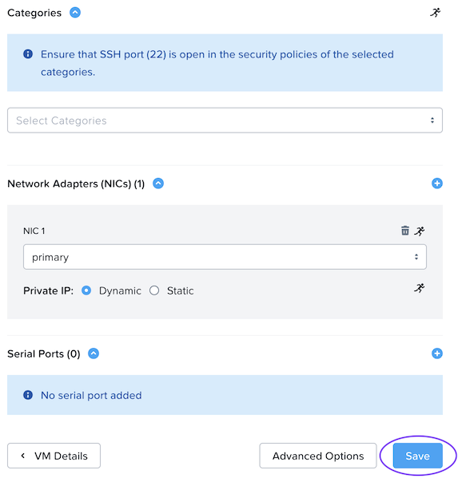
    
11. คลิก **Advanced Options** ทางซ้ายของปุ่ม Save.
    
    
    
12. คลิก **Add/Edit Credentials** ที่ด้านบนของหน้า. นี่เป็นสิ่งจำเป็นเพื่อทำการเปลี่ยนแปลงใดๆ ในส่วนนี้ทั้งหมด (blueprint จำเป็นต้องมี credential object อย่างน้อยหนึ่งรายการเพื่อ activate หน้าที่/การทำงานของ post provision automation ทั้งหมด.)
    
    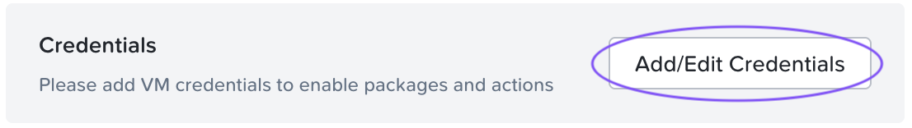
    
13. คลิก **Add Credential**, กรอกข้อมูลในช่องต่อไปนี้, และคลิก **Done**.
    
    -   **Name** `ROCKY`
    -   **Username** `rocky`
    -   **Password** `nutanix/4u`
    
    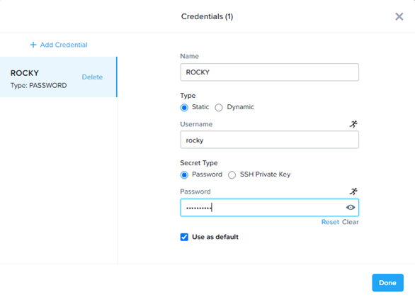

14. เลือก **ROCKY** ภายใน drop-down ของ _Credential_.
    
15. เลื่อนลงไปที่ส่วน _Update Configs (Optional)_, และคลิก **Add Config**.
    
16. ภายในช่อง _Name the update configuration_, ป้อน `User##`**UpdateConfig**.
    
17. คลิก **Update** ด้านขวาของแถว _Memory (GiB)_, กรอกข้อมูลในช่องต่อไปนี้, และคลิก **Done**.
    
    -   **Memory (GiB)** - Increase
    -   **Update** - 1
    -   เปิดสวิตช์ **Editable**
    -   **Max Value** - 6 

    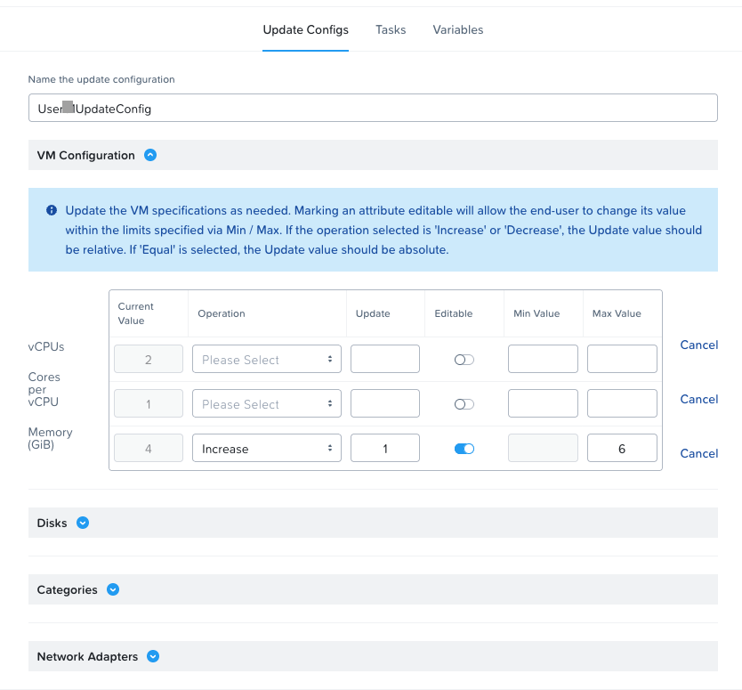

18. ภายในส่วน _Snapshot/Restore (Optional)_, คลิกที่ **Add Snapshot/Restore Config**. กรอกข้อมูลในช่องต่อไปนี้, และคลิก **Save**. สิ่งนี้จำเป็นเพื่อให้ผู้ใช้สามารถ snapshot application ได้.
    
    -   **Snapshot/Restore action suffix** - `User##`
    
    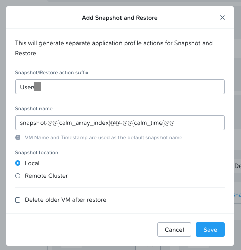
    
19. คลิกปุ่ม **Save** เพื่อบันทึก blueprint ทั้งหมด.
    
    ![](data:image/png;base64,iVBORw0KGgoAAAANSUhEUgAAAF8AAAA8CAYAAAAALGYBAAAABGdBTUEAALGPC/xhBQAAACBjSFJNAAB6JgAAgIQAAPoAAACA6AAAdTAAAOpgAAA6mAAAF3CculE8AAAAbmVYSWZNTQAqAAAACAACARIAAwAAAAEAAQAAh2kABAAAAAEAAAAmAAAAAAAEkoYABwAAABIAAABcoAEAAwAAAAEAAQAAoAIABAAAAAEAAABfoAMABAAAAAEAAAA8AAAAAEFTQ0lJAAAAU2NyZWVuc2hvdPuToeoAAAJpaVRYdFhNTDpjb20uYWRvYmUueG1wAAAAAAA8eDp4bXBtZXRhIHhtbG5zOng9ImFkb2JlOm5zOm1ldGEvIiB4OnhtcHRrPSJYTVAgQ29yZSA2LjAuMCI+CiAgIDxyZGY6UkRGIHhtbG5zOnJkZj0iaHR0cDovL3d3dy53My5vcmcvMTk5OS8wMi8yMi1yZGYtc3ludGF4LW5zIyI+CiAgICAgIDxyZGY6RGVzY3JpcHRpb24gcmRmOmFib3V0PSIiCiAgICAgICAgICAgIHhtbG5zOmV4aWY9Imh0dHA6Ly9ucy5hZG9iZS5jb20vZXhpZi8xLjAvIgogICAgICAgICAgICB4bWxuczp0aWZmPSJodHRwOi8vbnMuYWRvYmUuY29tL3RpZmYvMS4wLyI+CiAgICAgICAgIDxleGlmOkNvbG9yU3BhY2U+MTwvZXhpZjpDb2xvclNwYWNlPgogICAgICAgICA8ZXhpZjpQaXhlbFlEaW1lbnNpb24+NjA8L2V4aWY6UGl4ZWxZRGltZW5zaW9uPgogICAgICAgICA8ZXhpZjpVc2VyQ29tbWVudD5TY3JlZW5zaG90PC9leGlmOlVzZXJDb21tZW50PgogICAgICAgICA8ZXhpZjpQaXhlbFhEaW1lbnNpb24+OTU8L2V4aWY6UGl4ZWxYRGltZW5zaW9uPgogICAgICAgICA8dGlmZjpPcmllbnRhdGlvbj4xPC90aWZmOk9yaWVudGF0aW9uPgogICAgICA8L3JkZjpEZXNjcmlwdGlvbj4KICAgPC9yZGY6UkRGPgo8L3g6eG1wbWV0YT4KZwmuUwAABOFJREFUeAHtml+IVHUUx7/376xL/kldxVTMTFHTaFWiYv1Ptg9mWhkRPmVkEGSivYhgDxlEm5GCog+iD4qiaJYPCuFD/sMeKt2kpMwM1n9ZWZK7szNzp3Pu5e4ug4Jz71l/szvnwDAzd+7v/H7nc76/87v3d8cqkkHNCAHbSK/aaUhA4RsUgsJX+AYJGOxala/wDRIw2LUqX+EbJGCwa1W+wjdIwGDXqnyFb5CAwa5V+QbhuxJ9//BXgA3NeRxtCdBbt0gtAjVnuI13JruYNFBGs1baLWUGv/Bwe6+FXipOTsLnjb5IAlKnkBXfW9VeCp6/c6wcs4Slhs+lptpMKubU8KtJ9bHIpGJODT8ekL6XT0Dhl89MrIXCF0NZviOFXz4zsRYKXwxl+Y4qCr7DdzBVZCLbC2l5vfyIg7cnuRj5gIU/Wos4cTVA05k8rt6WuqhLO8LuaW9c+bMesvHRUx6a/wyw/HgOey4UMG+Egw+f9Lon4gryalz580c5aPmviOUnctE2xe/A7l8KGOBXEKVuGopx5fs0Ai4uD2Y6Cz6Xm59uRiXHpsNLxjo4Mj+DM4trsG2WjxnDomE3jnTwQckMmVpnY+vMKHPscel4F189n8HJhRmsmeJiWG1nP93E9J7dGoe/k1Q+tI+Fr1/IYMsMH4tGO/C6jKqfZ6GegPJm1qIjWVynNWHTdB8ZB7hMSXr1USdcK+KI35zgojUfJe6tx1wsGedgBc2qBbTzmqVtqI+frpxy1iXMePj39/30tQAzv8hi2/k8bdNaaCI4nIjnSNVsN9uLWHkyh2NXAvAsOXSpgD5ULB/ua+EsrRPnaEt78Zjo3CGUxNm0577r5wJY38smuth8Lo9mOudGWxHraREf25/OoXWmEsx4zWcI10jBDOZTek0eZOP9aS4+oSQcbYlmxcYGL5wdP1IpiouGY/GnInYS6Hcfd/HZ2Txeoqumi7eKOH09CM/vSyJ/7wkXK+j32Pr5FgbVxF7io2beO0dlpn/U0ghaaXucCwW/WM07zhew/hkbdaRkLhu1VHoaDmYR0AkM7psXMx2j/ZJmwuopXqj4V2gGbKcZxMZKb6cy0/R9Hgd/K3Scz31kO792HDfxwfj82zHHD58MzaVywYshP6p7Y4KDS6TgK3QV1NYFFC++S8dHJSaGxYnb/2sBa6d6qKPEHLgYPV8oEGU+/jqtAeMG2KEfLktcithPJZhx5a86lcPqeg8bG6JFlKF8dyPAylPRo8ntNAvqB9s4RutAjrhy7b9NwG/lWMORsdqfHeGH9f1fWiNiW/dtDmunedg3z8c/dJyh76X7CJ5BlWCpn+GO2dUmEgeDYeX/nS2GcEud8qUoX8XwTHBpvuYjgXecxlsTrPY7GS/UA2lWSN4xX3it5k5dlXXMuPLj0bIa+WbrbsZJia0UPB+/G3j+jWu/JHj2KWHGa75EED3Vh8I3mDmFr/ANEjDYtSq/J8OvkPuV+4pQKubUyuc70mozqZhTk+N/7UopoSckkWPlmCUsNXz+uzT/a5f3ZnpzEjg2jlHqH8qcvNTbCxIKqFYfqZVfreAk4lb4EhQT+lD4CcFJNFP4EhQT+lD4CcFJNFP4EhQT+lD4CcFJNFP4EhQT+lD4CcFJNFP4EhQT+lD4CcFJNFP4EhQT+lD4CcFJNPsf37BWFFJg2HUAAAAASUVORK5CYII=)
    

## Defining Variables

Variables อนุญาตให้ขยายการใช้งานของ Blueprints. ซึ่งหมายความว่า single Blueprint สามารถถูกนำไปใช้ในหลาย purposes และ environments ได้ ขึ้นอยู่กับ configuration ของ variables. Variables สามารถเป็น static values ที่ถูกบันทึกเป็นส่วนหนึ่งของ Blueprint หรืออาจจะระบุที่ _runtime_ (เมื่อ Blueprint ถูก launch), เหมือนในกรณีนี้.

ใน Single VM Blueprint, สามารถเข้าถึง variables ได้โดยการคลิกปุ่ม _App variables_ ใกล้ๆ ด้านบน. โดยค่าเริ่มต้น variables จะถูกเก็บเป็น _String_, อย่างไรก็ตามยังมี _Data Types_ เพิ่มเติม (Integer, Multi-line String, Date, Time, และ Date Time) ที่เป็นไปได้. ใดๆ ของ data types เหล่านี้สามารถถูกเลือกให้เป็น _Secret_ ซึ่งจะซ่อน value ของมันและเหมาะสำหรับ variables เช่นรหัสผ่าน. ยังมี _Input Types_ ที่ advance มากขึ้น (เทียบกับค่าเริ่มต้นที่เป็น _Simple_), แต่สิ่งเหล่านี้อยู่นอกเหนือ scope ของ lab นี้.

Variables สามารถใช้ใน scripts ที่ถูก execute กับ objects ได้โดยใช้โครงสร้าง `@@{variable_name}@@` (เรียกว่า macro). Self Service จะ expand และแทนที่ variable ด้วย value ที่เหมาะสมก่อนที่จะส่งไปยัง VM.

1.  คลิกปุ่ม **App variables** แถบด้านบนเพื่อเปิด variables menu.
    
2.  ใน pop-up ที่ปรากฏขึ้น คุณจะเห็น note ระบุว่าในปัจจุบันคุณไม่มี variables ใดๆ. คลิกปุ่ม **Add Variable**, และกรอกข้อมูลในช่องต่อไปนี้.
    
    -   ในคอลัมน์ด้านซ้าย ให้คลิกเพื่อกำหนดให้เป็น runtime variable.
    -   ในเมนเพน (main pane), กำหนด _Name_ ของ variable ให้เป็น `vm_name_prefix`.
    -   คลิก link **Show Additional Options** ที่ด้านล่าง.
    -   ทำเครื่องหมายถูกที่ checkbox **Mark this variable mandatory**. สิ่งนี้รับประกันว่ามีการ input value เข้าไป เนื่องจาก variable นี้จะเป็นส่วนหนึ่งของ VM name.

3.  คลิก **Done > Save**.    

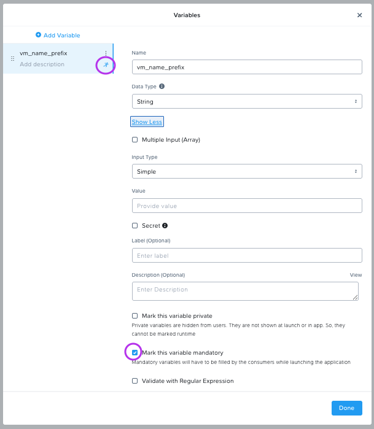

## Launching the Blueprint

เมื่อ Blueprint ของเราเสร็จสมบูรณ์ สังเกตปุ่มที่อยู่ทางซ้ายของปุ่ม save:

-   _Publish_ - ส่วนนี้อนุญาตให้เราร้องขอ publish Blueprint ไปยัง Marketplace. Blueprints จะทำ mapping 1:1 ไปยัง Project. นี่หมายความว่าจะมีเพียง users ที่เป็น members ของ Project ของเราเท่านั้นที่มีสิทธิ์ launch Blueprint นี้. การ publishing Blueprints ไปยัง Marketplace จะอนุญาตให้ administrator สามารถกำหนดจำนวนของ Projects ลงบน Marketplace Blueprint ซึ่งจะไปทำการ enable self service แก่ end users จำนวนเท่าใดก็ได้ตามที่ต้องการ.
-   _Download_ - option นี้ดาวน์โหลด Blueprint ในรูปแบบ JSON, ซึ่งสามารถถูกเช็คเข้าสู่ source control หรือถูกอัปโหลดลงใน Self Service instance อื่นได้.
-   _Launch_ - ฟังก์ชันนี้ launch ตัว Blueprint ของเราและ deploy ข้อมูลของ application และ/หรือ infrastructure.


1.  คลิก **Launch** และกรอกข้อมูลต่อไปนี้:
    
    -   **Application Name** - `User##`-Rocky-IaaS
    -   **vm_name_prefix** - `User##`
    
    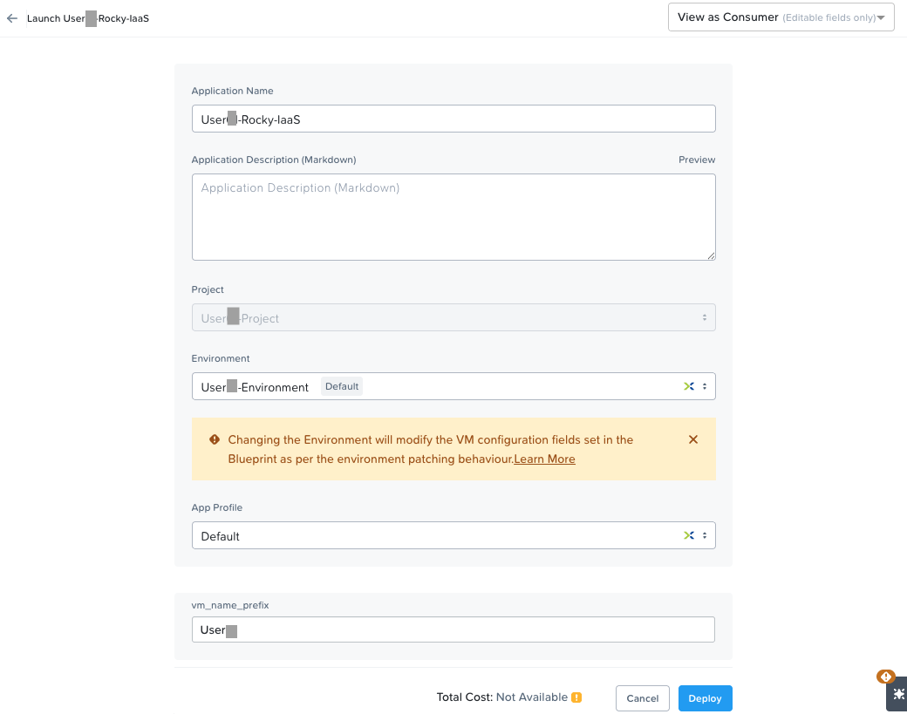
    
2.  คลิก **Deploy**. คุณจะเห็น launch status dialog box ดังต่อไปนี้.
    
    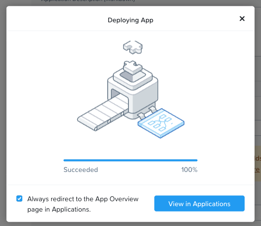

2.  คลิก **View in Applications** เมื่อสามารถคลิกได้ – คุณจะถูก redirect ไปยังหน้า application. การ deployment น่าจะใช้เวลาประมาณ 2 นาทีหรือน้อยกว่านั้น.

## Managing your Application

รอให้ application ของคุณเปลี่ยน state จาก _Provisioning_ เป็น _Running_. หากมันเปลี่ยนเป็น _Error_ state แทน, ให้ navigate ไปยังแท็บ _Audit_, และ expand ที่ _Create_ action เพื่อเริ่มต้น troubleshooting ปัญหาของคุณ.

เมื่อ application ของคุณอยู่ใน _Running_ state, ลอง navigate ดูรอบๆ 5 แท็บใน UI:


-   _Overview_ ให้ข้อมูลเกี่ยวกับ variables ต่างๆที่ถูกระบุไว้, ค่าใช้จ่ายที่เกิดขึ้น (showback สามารถถูก configure ได้ใน Self Service Settings), application summary, และ VM summary.
-   _Manage_ อนุญาตให้คุณ run actions ต่างๆ บน application/infrastructure. ซึ่งรวมถึง basic lifecycle (start, restart, stop, delete), NGT management (install, manage, uninstall), และ App Update, ซึ่งช่วยอนุญาตให้แก้ไข basic VM resources.
-   _Metrics_ แสดงข้อมูลเชิงลึกเกี่ยวกับ CPU, Memory, Storage, และ Network utilization.
-   _Recovery Points_ แจกแจง history ของ VM Snapshots และอนุญาตให้ผู้ใช้ restore VM ไปยัง point ใดๆ ในเหล่านี้.
-   _Audit_ แสดงทุก action ที่ run ภายใน application, เวลาและ user ที่ run action เหล่านั้น, และข้อมูลเชิงลึกเกี่ยวกับ results ของ action เหล่านั้น ซึ่งรวมถึง script output.

ต่อไป ให้ไปดู common VM tasks ที่มีอยู่ในมุมขวาบนของ UI:


-   _View Source Blueprint_ ดู Blueprint ที่ deploy ตัว application มา.
-   _Create Image_ สร้าง images จาก single-VM หรือ multi-VM application ปัจจุบันที่ running อยู่บนแพลตฟอร์ม Nutanix.
-   _Clone_ อนุญาตให้ผู้ใช้ duplicate application ปัจจุบันเข้าไปยัง app ใหม่ที่สามารถ manage แยกได้จาก application ในปัจจุบัน. สำหรับ brand new application การทำสิ่งนี้มีค่าเท่ากับการ launch Blueprint ใหม่อีกครั้ง. อย่างไรก็ตาม ผู้ใช้อาจจะใช้เวลาในการ customizing ตัว application ไปเยอะมากๆ เพื่อให้ตรงกับ needs โดยเฉพาะ, และต้องการให้ changes เหล่านี้เข้าไปอยู่ใน app ใหม่ด้วย.
-   _Launch Console_ ทำการเปิดหน้าต่าง console เพื่อไปยัง VM.
-   _Update_ อนุญาตให้ end user ปรับแต่ง basic VM settings (เทียบเท่ากับ _Manage > App Update_ action).
-   _Delete_ ทำการลบ underlying VM และลบ Self Service Application (เทียบเท่ากับ _Manage > App Delete_ action).

ก่อนที่เราจะสร้าง changes อะไรให้แก่ application, มาสร้าง snapshot กันก่อนเพื่อที่เราสามารถ restore มันขึ้นมาหากเกิดปัญหาขึ้น.

1.  ภายในแท็บ _Manage_, ให้คลิกบนปุ่มที่ติดกับ **Snapshot_`User##`**, และคลิก **Run**.
    
    หากคุณต้องการตรวจสอบ progress ของ snapshot, คลิกบนแท็บ **Audit**.
    
    เมื่อเราคุ้นเคยกับ layout บนหน้า application แล้ว, และเรามี snapshot ถูกสร้างขึ้นแล้ว, มาเริ่ม modify application ของเราโดยทำการเพิ่ม memory ของเรา.
    
    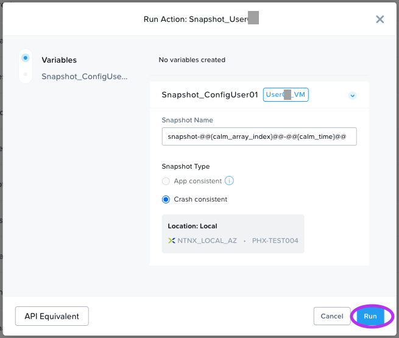
    
2.  คลิก **Launch Console**, และ log in โดยใช้ credentials ดังต่อไปนี้.
    
    -   **Username** - `rocky`
    -   **Password** - `nutanix/4u`

3.  เพื่อจะดู current memory บน Rocky VM, ทำการ run คำสั่ง `free -h`. โน้ตจำ memory ที่ถูก allocate ไว้ให้ VM ของคุณในปัจจุบัน.
    
4.  กลับไปที่หน้า _Application_ ภายใน Self Service. คลิกแท็บ **Manage**. คลิกปุ่มที่ติดกับ `User##`**UpdateConfig**. ทำการเพิ่ม **Memory (GiB)** เป็นจำนวน 2 GiB โดยการใส่ค่า **6** ใน text field.
    
5.  คลิก **Run**.
    
6.  ในแท็บ _Audit_ ของ Self Service, รอให้สถานะของ `User##`UpdateConfig เปลี่ยนเป็น _Running_.
    
7.  กลับไปที่ console. และ run `free -h` อีกรอบนึง. โน้ตจำ memory ปัจจุบันที่ถูก allocate ให้แก่ VM, และดูว่ามันเพิ่มมาอีก 2 GiB.
    
    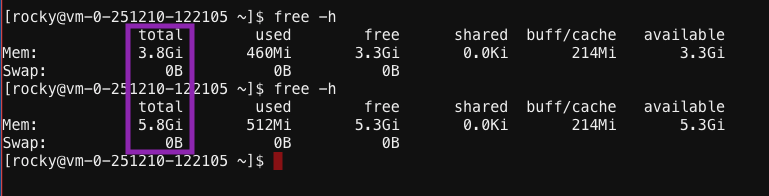
    

หากมีปัญหาใดๆ กับ VM Update, ทำการ navigate ไปที่แท็บ _Manage_. คลิกปุ่มที่ติดกับ _Restore_`User##`_ เพื่อ revert application ของคุณไปยัง state ที่ถูกเก็บไว้ใน snapshot ก่อนหน้า.

## Takeaways

อะไรคือ key things ที่คุณควรรู้เกี่ยวกับ Nutanix Self Service และ Single VM Blueprints?

-   Self Service มอบความสามารถในการทำ application และ infrastructure automation แบบ native ใน Prism, ซึ่งเปลี่ยนจากกระบวนการ ticketing processes ที่ยุ่งยากที่ต้องใช้เวลาเป็นสัปดาห์, เป็น one-click self service provisioning.
-   มีหลาย methods ให้ configure และ control สำหรับ credentials.
-   ขณะที่ Multi VM Blueprints จะช่วยให้การทำ provisioning และ lifecycle management ของ complex, multi-tiered applications ได้แบบสมบูรณ์, ตัว Single VM Blueprints จะช่วยให้ IT สามารถให้ Infrastructure-as-a-Service สำหรับ end users.
-   Day 2 operations ทั่วไป เช่น การทำ snapshots, restoring, cloning, และอัปเดต infrastructure ทั้งหมดสามารถทำได้โดยตรงผ่าน end users ใน Self Service.
