# Self Service IaaS: Windows

## Overview

Nutanix Self Service ช่วยให้คุณสามารถเลือก, provision, และจัดการ business applications ต่างๆ ใน infrastructure สำหรับทั้ง private และ public clouds ได้อย่างราบรื่น. Nutanix Self Service ให้บริการด้าน App lifecycle, monitoring, และ remediation เพื่อจัดการ heterogeneous infrastructure ของคุณ เช่น VMs หรือ bare-metal servers. Nutanix Self Service รองรับ multiple platforms, ดังนั้นคุณสามารถใช้ single self-service และ automation interface เพื่อจัดการ infrastructure ของคุณได้.

Infrastructure-as-a-Service (IaaS) คือความสามารถในการจัดหา compute resources ได้อย่างรวดเร็วแบบ on-demand ผ่าน self-service portal. ขณะที่ลูกค้าหลายรายใช้ Nutanix Self Service เพื่อ orchestrate ตัว complex, multi-tiered applications, ส่วนสำคัญอีกส่วนยังใช้ Self Service เพื่อให้บริการ basic IaaS สำหรับ end users ของพวกเขาด้วย.

ใน lab นี้ คุณจะได้สร้าง _Single VM Blueprint_ ที่ใช้ Windows Server 2022, launch Blueprint, และจัดการ application ที่ได้.

## Creating a Single VM Blueprint

Blueprint คือ framework สำหรับทุก application หรือ infrastructure ที่คุณ model โดยใช้ Nutanix Self Service. ในขณะที่ complex, multi-tiered applications ใช้ _Multi VM/Pod Blueprint_, อินเทอร์เฟซที่ปรับให้เรียบง่ายของ _Single VM Blueprint_ เอื้อต่อการใช้งานของ IaaS use cases. คุณสามารถ model แต่ละประเภทของ infrastructure ที่บริษัทของคุณใช้งาน (ตัวอย่างเช่น, Windows, CentOS, หรือ Ubuntu) ไว้ใน Single VM Blueprint ได้. End users สามารถ launch Blueprint ซ้ำๆ เพื่อสร้าง infrastructure ได้ตามต้องการ. Infrastructure ที่ได้ (ซึ่งเรียกว่า _application_) สามารถถูกจัดการได้ตลอด entire lifecycle ภายใน Self Service, รวมถึงการจัดการ Nutanix Guest Tools (NGT), การแก้ไข resources, snapshots, และ clones.

   1. ภายใน Prism Central, คลิกที่ **App switcher** และเลือก **Self Service**
    
      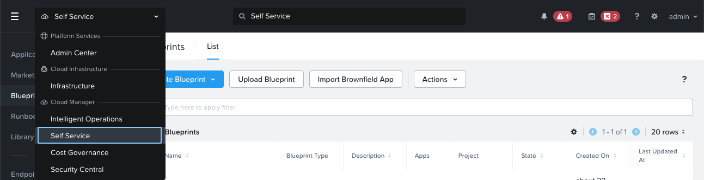
    
   2. เลือก **Blueprints** ในแถบเมนูด้านซ้าย
    
      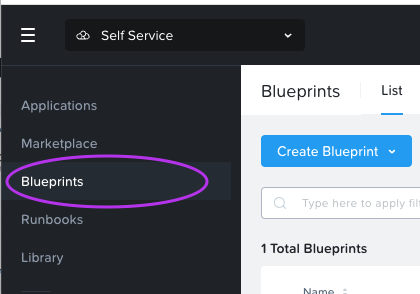
    
   3. คลิก **Create Blueprint > Single VM Blueprint**.
    
      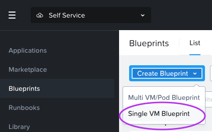
    
   4. กรอกข้อมูลในช่องต่อไปนี้:
    
      - **Name** - `User##`-Win-IaaS
      - **Project** - `User##`-Project
      - **Environment** - `User##`-Environment
    
      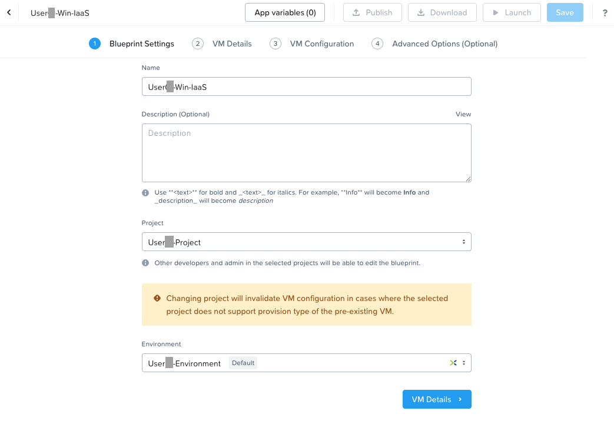
    
   5. คลิก **VM Details**.
    
   6. กรอกข้อมูลในช่องต่อไปนี้บนหน้า **VM Details**:
    
      - **Name** - `User##`_VM
      - **Operating System** - เลือก **Windows** จาก drop-down.
    
      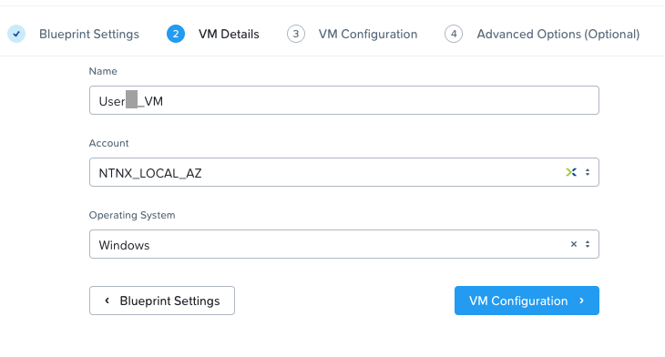
    
   7. คลิก **VM Configuration**.
    
      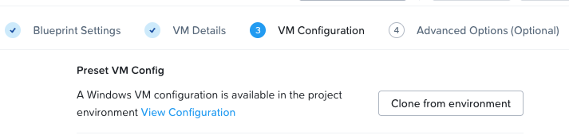
    
   8. คลิก **Clone from environment**. เนื่องจากคุณได้ระบุ details สำหรับ Windows VM ของคุณใน Project ก่อนหน้านี้แล้ว คุณจึงไม่ต้องป้อนข้อมูลเดิมซ้ำอีก.
    
      โปรดสังเกต `@@{vm_name_prefix}@@`. ตัวอักษร `@@{` และ `}@@` ใน Self Service เป็นตัวแทนของ macro. Self Service จะเปลี่ยนมันให้เป็น value(s) ที่ถูกต้องที่ runtime อัตโนมัติเมื่อเจอกับ macro. Macro อาจหมายถึง system-defined value, VM property, หรือ (อย่างในกรณีนี้) เป็น runtime variable.
    
      Self Service macros เป็นส่วนหนึ่งของ templating language สำหรับ scripts ของ Self Service. Execution engine ของ Self Service จะทำการ evaluate สิ่งเหล่านี้ก่อนที่ script จะทำงาน.
    
      Macros ทำให้คุณสามารถเข้าถึง value ของ variables และ properties ที่กำหนดไว้บน entities ได้. Variables เหล่านี้จะเป็นแบบ user-defined หรือ system generated ก็ได้. โปรดดูในส่วน [Variables Overview](https://portal.nutanix.com/page/documents/details?targetId=Nutanix-Calm-Admin-Operations-Guide-v3_5_2:nuc-macros-variables-overview-c.html) ของ Self Service Administration and Operations Guide.
    
      - _General Configuration_ - ป้อน `@@{vm_name_prefix}@@-@@{calm_unique}@@` ลงในช่อง _VM Name_.
        
      - _Guest Customization_ - Guest customization อนุญาตให้แก้ไข specific settings ได้ตอน boot. Linux ใช้ _cloud-init_, ในขณะที่ Windows ใช้ _Sysprep_. เลือกช่อง **Guest Customization**, เลือก **Prepared** จาก _Install Type_ drop-down, และวาง script ต่อไปนี้.
        
         - Windows 2022
            
            ```
            <?xml version="1.0" encoding="UTF-8"?>
            <unattend xmlns="urn:schemas-microsoft-com:unattend">
               <settings pass="oobeSystem">
                  <component name="Microsoft-Windows-Shell-Setup" xmlns:wcm="http://schemas.microsoft.com/WMIConfig/2002/State" xmlns:xsi="http://www.w3.org/2001/XMLSchema-instance" processorArchitecture="amd64" publicKeyToken="31bf3856ad364e35" language="neutral" versionScope="nonSxS">
                     <OOBE>
                        <HideEULAPage>true</HideEULAPage>
                        <HideOEMRegistrationScreen>true</HideOEMRegistrationScreen>
                        <HideOnlineAccountScreens>true</HideOnlineAccountScreens>
                        <HideWirelessSetupInOOBE>true</HideWirelessSetupInOOBE>
                        <NetworkLocation>Work</NetworkLocation>
                        <SkipMachineOOBE>true</SkipMachineOOBE>
                     </OOBE>
                     <UserAccounts>
                        <AdministratorPassword>
                           <Value>@@{WINDOWS.secret}@@</Value>
                           <PlainText>true</PlainText>
                        </AdministratorPassword>
                     </UserAccounts>
                     <FirstLogonCommands>
                        <SynchronousCommand wcm:action="add">
                           <CommandLine>cmd.exe /c netsh firewall add portopening TCP 5985 "Port 5985"</CommandLine>
                           <Description>Win RM port open</Description>
                           <Order>1</Order>
                           <RequiresUserInput>true</RequiresUserInput>
                        </SynchronousCommand>
                        <SynchronousCommand wcm:action="add">
                           <CommandLine>powershell -Command "Enable-PSRemoting -SkipNetworkProfileCheck -Force"</CommandLine>
                           <Description>Enable PS-Remoting</Description>
                           <Order>2</Order>
                           <RequiresUserInput>true</RequiresUserInput>
                        </SynchronousCommand>
                        <SynchronousCommand wcm:action="add">
                           <CommandLine>powershell -Command "Set-ExecutionPolicy -ExecutionPolicy RemoteSigned"</CommandLine>
                           <Description>Enable Remote-Signing</Description>
                           <Order>3</Order>
                           <RequiresUserInput>false</RequiresUserInput>
                        </SynchronousCommand>
                     </FirstLogonCommands>   
                  </component>
                  <component name="Microsoft-Windows-International-Core" xmlns:wcm="http://schemas.microsoft.com/WMIConfig/2002/State" xmlns:xsi="http://www.w3.org/2001/XMLSchema-instance" processorArchitecture="amd64" publicKeyToken="31bf3856ad364e35" language="neutral" versionScope="nonSxS">
                     <InputLocale>en-US</InputLocale>
                     <SystemLocale>en-US</SystemLocale>
                     <UILanguageFallback>en-us</UILanguageFallback>
                     <UILanguage>en-US</UILanguage>
                     <UserLocale>en-US</UserLocale>
                  </component>
               </settings>
               <settings pass="specialize">
                  <component name="Microsoft-Windows-Shell-Setup" xmlns:wcm="http://schemas.microsoft.com/WMIConfig/2002/State" xmlns:xsi="http://www.w3.org/2001/XMLSchema-instance" processorArchitecture="amd64" publicKeyToken="31bf3856ad364e35" language="neutral" versionScope="nonSxS">
                     <ComputerName>@@{name}@@</ComputerName>
                     <RegisteredOrganization>Nutanix</RegisteredOrganization>
                     <RegisteredOwner>Acropolis</RegisteredOwner>
                     <TimeZone>UTC</TimeZone>
                  </component>
                  <component name="Microsoft-Windows-TerminalServices-LocalSessionManager" xmlns="" publicKeyToken="31bf3856ad364e35" language="neutral" versionScope="nonSxS" processorArchitecture="amd64">
                     <fDenyTSConnections>false</fDenyTSConnections>
                  </component>
                  <component name="Microsoft-Windows-TerminalServices-RDP-WinStationExtensions" xmlns="" publicKeyToken="31bf3856ad364e35" language="neutral" versionScope="nonSxS" processorArchitecture="amd64">
                     <UserAuthentication>0</UserAuthentication>
                  </component>
                  <component name="Networking-MPSSVC-Svc" xmlns:wcm="http://schemas.microsoft.com/WMIConfig/2002/State" xmlns:xsi="http://www.w3.org/2001/XMLSchema-instance" processorArchitecture="amd64" publicKeyToken="31bf3856ad364e35" language="neutral" versionScope="nonSxS">
                     <FirewallGroups>
                        <FirewallGroup wcm:action="add" wcm:keyValue="RemoteDesktop">
                           <Active>true</Active>
                           <Profile>all</Profile>
                           <Group>@FirewallAPI.dll,-28752</Group>
                        </FirewallGroup>
                     </FirewallGroups>
                  </component>
               </settings>
            </unattend>
            ```
            
            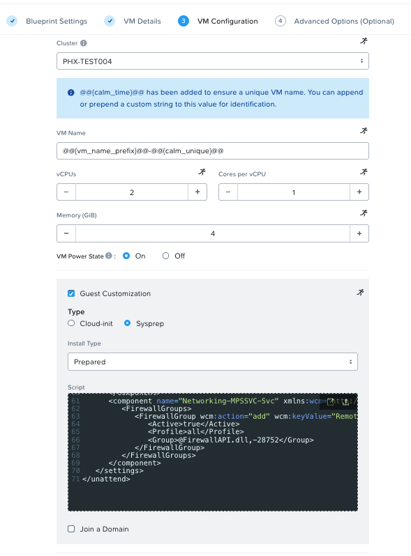
             
      - _Disks_ - Disk คือ storage ของ VM หรือ infrastructure ที่เรากำลัง deploy. มันอาจจะอิงจาก pre-existing image (เหมือนในกรณีของเรา), หรืออาจจะอิงจาก blank disk เพื่อให้ VM สามารถ consume storage เพิ่มเติมได้. ตัวอย่างเช่น, Microsoft SQL server อาจจะต้องการ base OS disk, SQL Server binary disk ที่แยกออกมา, database data file disks ที่แยกออกมา, TempDB disks ที่แยกออกมา, และ logging disk ที่แยกออกมา. ในกรณีของเรา, เราจะมี single disk ที่ base บน pre-existing image.
        
         -  _Disk Type_ - ประเภทของ disk.
         -  _Bus Type_ - Bus type ของ disk.
         -  _Operation_ - วิธีที่ disk จะถูก sourced มา.
         -  _Image_ - Image ที่ VM จะนำมาเป็น base. เลือก **WindowsServer2022.qcow2**.
         -  _Bootable_ - ว่า disk เฉพาะเจาะจงนี้สามารถเป็น bootable ได้หรือไม่. อย่างน้อยต้องมีหนึ่ง disk ที่ _must_ เป็น bootable.

      -  _Boot Configuration_ - วิธีการ boot ของ VM.
        
      -  _vGPUs_ - ว่า VM จำเป็นต้องใช้ virtual graphical processing unit หรือไม่.
        
      -  _Categories_ - Categories ครอบคลุม products และ solutions หลายรายการภายใน Nutanix portfolio. สิ่งเหล่านี้อนุญาตให้คุณ set ตัว security policies, protection policies, alert policies, และ playbooks. เพียงเลือก categories ที่ตรงกับ workload, แล้ว policies เหล่านี้จะถูก applied โดยอัตโนมัติ.
        
      -  _NICs_ - Network adapters อนุญาตให้มีการสื่อสารไปยังและมาจาก virtual machine ของคุณ.
        
      -  _Serial Ports_ - ว่า VM จำเป็นต้องใช้ virtual serial port หรือไม่.
   
         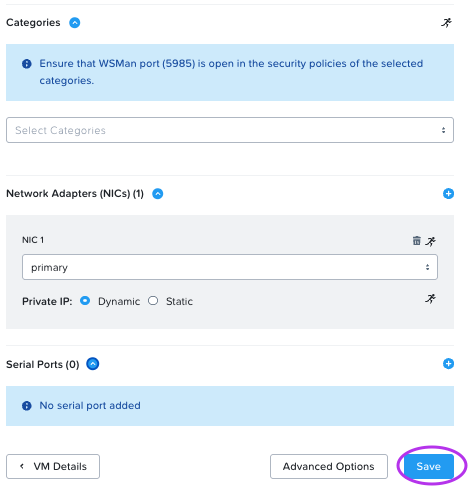

   9. คลิกปุ่ม **Save** ที่ด้านล่าง (นี่จะบันทึก current status ของ blueprint. เป็นการดีที่จะบันทึกการ updates ลงใน blueprint ขณะที่คุณ navigate ไปตามขั้นตอนการแก้ไขต่างๆ ของ blueprint.)
    
   10. คลิก **Advanced Options** ถัดจากปุ่ม **Save**.
    
   11. คลิก **Add/Edit Credentials** เพื่อทำการ changes ใน section นี้.
    
   12. คลิก **Add Credential**, กรอกข้อมูลในช่องต่อไปนี้, และคลิก **Done**.
    
      -  **Name** `WINDOWS`
      -  **Username** `administrator`
      -  **Password** `nutanix/4u`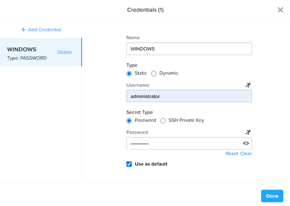

   13. เลือก **Windows** ภายใน drop-down เมนูของ _Credential_.
    
   14. เลื่อนลงไปยังส่วน _Update Configs (Optional)_, และคลิก **Add Config**.
    
   15. ในช่อง _Name the update configuration_, ใส่คำว่า `User##`**UpdateConfig**.
    
   16. คลิก **Update** ทางด้านขวาของแถว _Memory (GiB)_, กรอกข้อมูลในช่องต่อไปนี้, และคลิก **Done**.
    
      -  **Memory (GiB)** - Increase
      -  **Update** - 1
      -  เปิดใช้งานสวิตช์ **Editable**
      -  **Max Value** - 6 

      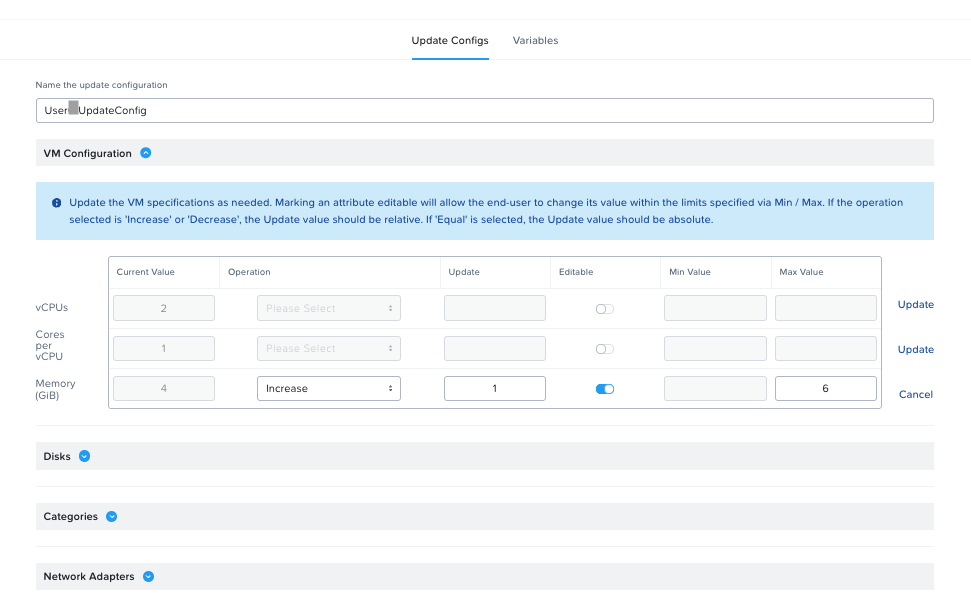

   17. ภายในส่วน _Snapshot/Restore (Optional)_, ให้คลิกที่ **Add Snapshot/Restore Config**. กรอกข้อมูลในช่องต่อไปนี้, และคลิก **Save** เพื่ออนุญาตให้ผู้ใช้ทำ snapshot ของ application ได้.
    
      -  **Snapshot/Restore action suffix** - `User##`
    
      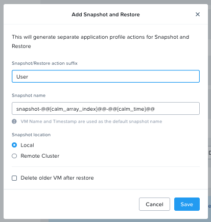
    
   18. คลิกปุ่ม **Save**.
    

## Defining Variables

Variables ช่วยสร้าง extensibility ของ Blueprints. Single Blueprint หนึ่งๆสามารถนำไปใช้กับ multiple purposes และ environments ได้ ขึ้นอยู่กับการ configuration ของตัว variables ของมัน. Variables สามารถเป็น static values ที่ถูก saved เป็นส่วนหนึ่งของ Blueprint ได้ หรือเป็นค่าที่ถูก specified ที่ _runtime_ (เมื่อ Blueprint ถูก launch), แบบที่จะเป็นในกรณีนี้.

ใน Single VM Blueprint, สามารถเข้าถึง variables ได้โดยการคลิกปุ่ม _App variables_ ใกล้ๆด้านบน. ค่าเริ่มต้น variables จะถูกเก็บเป็นรูปแบบของ _String_. แต่อย่างไรก็ตาม, _Data Types_ เพิ่มเติม (Integer, Multi-line String, Date, Time, และ Date Time) ล้วนเป็นไปได้ทั้งสิ้น. Any data type สามารถตั้งค่าเป็น _Secret_ ได้, ซึ่งจะทำหน้าที่ปิดบังค่ามันไว้ และเหมาะสำหรับ variables แบบพวก passwords. นอกจากนี้ยังมี _Input Types_ ที่ขั้นสูงกว่า (เมื่อเทียบกับค่า default _Simple_), อย่างไรก็ตาม, สิ่งเหล่านี้อยู่นอกเหนือขอบเขตของ lab นี้.

ใน scripts ที่ทำงานกับ objects ต่างๆ, variables สามารถนำมาใช้ได้โดยโครงสร้าง `@@{variable_name}@@` (เรียกว่า macro). Self Service จะทำการ expand และแทนที่ตัว variable ด้วยค่า value ที่ถูกต้องเหมาะสม ก่อนที่จะส่งมันไปยัง VM.

1.  คลิกที่ปุ่ม **App variables** บนพาเนลด้านบนเพื่อเปิด variables menu.
    
2.  ใน pop-up ที่ปรากฏขึ้น คุณควรจะเห็น note บอกว่าคุณยังไม่มี variables ในปัจจุบัน. คลิกปุ่ม **Add Variable**, และกรอกข้อมูลในช่องต่อไปนี้.
    
    -   ในคอลัมน์ซ้ายมือ ให้คลิกเพื่อมาร์คค่านี้ให้เป็น runtime variable.
    -   ในเมนเพนหลัก, ตั้งค่าตัว variable _Name_ เป็น `vm_name_prefix`.
    -   คลิก link **Show Additional Options** ที่ด้านล่าง.
    -   ทำเครื่องหมายตรงช่อง **Mark this variable mandatory** เพื่อทำให้มั่นใจว่าจะมีการใส่ input value เข้ามา, เนื่องจาก variable นี้มีส่วนช่วยในการตั้งชื่อของ VM.
    
    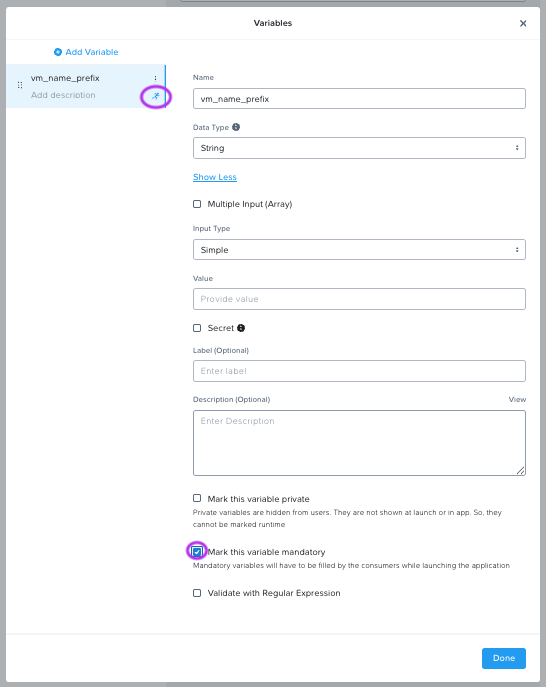
    
3.  คลิก **Done > Save**.
    

## Launching the Blueprint

ตอนนี้ที่ Blueprint ของเราสร้างเสร็จแล้ว โปรดสังเกตปุ่มทางด้านซ้ายของปุ่ม save:

-   _Publish_ อนุญาตให้เราส่งคำร้องขอ publish Blueprint เข้าไปใน Marketplace. Blueprints จะทำ 1:1 mapping เข้ากับ Project หนึ่งๆ. จะมีเพียงแค่ผู้ใช้ที่เป็น members ของ Project ของเราเท่านั้นที่จะสามารถ launch Blueprint นี้ได้. การ Publish Blueprints เข้าสู่ Marketplace จะทำให้ administrator สามารถ assign จำนวนของ Projects เข้าสู่ Marketplace Blueprint ได้, ซึ่งมันไปทำหน้าที่ enable ฟีเจอร์ self-service สำหรับ end users ทุกๆ คนที่ต้องการใช้งาน.
-   _Download_ - option นี้ดาวน์โหลด Blueprint ออกมาใน format แบบ JSON, ซึ่งสามารถนำไป check เข้าสู่ source control หรือจะนำไป upload เข้าสู่ Self Service instance อีกอันหนึ่งได้.
-   _Launch_ - สิ่งนี้จะ launch Blueprint ของเรา และ deploy ไปสู่ application หรือ infrastructure ของเรา.


   1.  คลิก **Launch** และป้อนข้อมูลต่อไปนี้:
      
      -   **Application Name** - `User##`-Win-IaaS
      -   **vm_name_prefix** - `User##`

      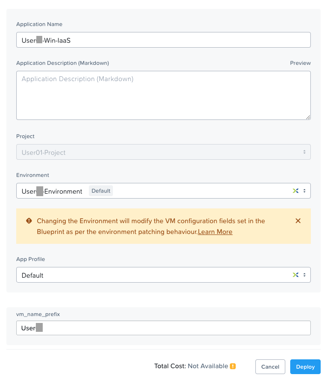

   2.  คลิก **Deploy**. คุณจะเห็น launch status dialog box ขึ้นมา.

      

   3.  คลิก **View in Applications**. คุณจะถูก redirect ไปยังหน้า application. การ deployment น่าจะใช้เวลาประมาณ 2 นาทีหรือน้อยกว่านั้น.

## Managing your Application

รอให้ application ของคุณเปลี่ยน state จาก _Provisioning_ เป็น _Running_. หากมันเปลี่ยนเป็น _Error_ state แทน, ให้ไปที่ tab _Audit_, และขยายส่วน _Create_ action ขึ้นมา เพื่อเริ่มต้นแก้ปัญหา.

เมื่อ application ของคุณอยู่ในสถานะ _Running_, ลอง navigate สังเกตไปรอบๆ 5 แท็บในส่วนของ UI:


-   _Overview_ ให้ข้อมูลเกี่ยวกับ variables ต่างๆที่ระบุไว้, ค่าใช้จ่ายที่เกิดขึ้น (showback สามารถ configure ได้ใน Self Service Settings), ตัว application summary, และ VM summary.
-   _Manage_ อนุญาตให้คุณรัน actions กับ application/infrastructure. ซึ่งรวมไปถึง basic lifecycle (start, restart, stop, delete), NGT management (install, manage, uninstall), และ App Update, ซึ่งอนุญาตให้มีการ edit ใน basic VM resources.
-   _Metrics_ จะแสดงข้อมูล in-depth เกี่ยวกับ CPU, Memory, Storage, และ Network utilization.
-   _Recovery Points_ สร้าง list โชว์ history ของ VM Snapshots และยังทำให้ user สามารถ restore ตัว VM ไปยัง points ใดก็ได้ที่มีอยู่.
-   _Audit_ จะแสดงทุกๆ action ที่รันบน application, แสดงเวลาและ user ที่รัน action นั้นๆ, รวมทั้งบอก in-depth information บน results ของ action เหล่านั้นด้วย ซึ่งรวมไปถึง script output.

   จากนั้นมาดูที่หน้า everyday VM tasks ซึ่งหาได้ที่มุมขวาบนของ UI:

   

-   _View Source Blueprint_ ใช้สำหรับดู Blueprint ที่ application ตัวนั้นๆ deploy ออกมา.
-   _Create Image_ สร้าง images ที่มาจาก single-VM หรือ multi-VM application ที่กำลังรันอยู่บน Nutanix platform.
-   _Clone_ อนุญาตให้ user ถอดแบบ (duplicate) ตัว application ที่มีอยู่ให้เป็นตัวใหม่ที่ยังสามารถ manage    แยกจากอันเดิมได้, ซึ่งก็เทียบเท่ากับ relaunching ตัว Blueprint เพื่อสร้าง application อันใหม่. อย่างไรก็ตาม, user บางคนอาจจะใช้เวลาในการ customizing application จนเหมาะสมกับ needs ของเค้า แล้วจึงอยากให้ changes เหล่านี้ติดไปบน app ตัวใหม่ด้วย.
-   _Launch Console_ ใช้เปิดหน้าต่าง console ตัว VM ออกมา.
-   _Update_ ทำให้ end user สามารถ modify basic VM settings ได้ (เทียบเท่ากับ action ของ _Manage > App Update_).
-   _Delete_ ใช้ลบตัว underlying VM และ Self Service Application (เทียบเท่ากับ action ของ _Manage > App Delete_).

ก่อนที่เราจะทำการ changes อะไรกับ application ของเรา, ลองมาสร้าง snapshot เตรียมเอาไว้ก่อน เผื่อเราต้องทำการ restore ถ่าเกิดมีอะไรผิดพลาดไป.

   1.  ในหน้า _Manage_ tab, ให้คลิกปุ่มที่อยู่ใกล้กับ **Snapshot_'User ##`**, และคลิก **Run**.
      
      ถ้าคุณต้องการ monitor ตัว snapshot progress, ให้คลิกที่ **Audit** tab.
      
      ตอนนี้เราคุ้นเคยกับ application page layout แล้ว และสร้าง snapshot สำเร็จแล้ว ต่อไปเราจะทำการ modify ตัว application ของเราโดยการเพิ่ม memory เพิ่มเติม.
      
      
      
   2.  คลิก **Launch Console** และทำการ log in โดยใช้ credentials ดังนี้.
      
      -   **Username** - `administrator`
      -   **Password** - `nutanix/4u`

   3.  ถ้าจะดู current memory บนเครื่อง Windows, ให้เปิด **Command Prompt** ขึ้นมาแล้วรันคำสั่ง `systeminfo | findstr Memory`. สังเกตดู current memory ที่ถูก allocate ไว้ให้กับ VM ของคุณ.
      
   4.  กลับไปที่หน้า _Application_ ภายใน Self Service. คลิกแท็บ **Manage**. คลิกปุ่มที่อยู่ใกล้กับ `User##`**UpdateConfig**. ทำการเพิ่ม **Memory (GiB)** เป็นจำนวน 2 GiB โดยการกรอกเลข **6** ลงในช่องข้อความ.
      
   5.  คลิก **Run**.
      
   6.  เข้าไปใน _Audit_ tab ของ Self Service, รอจนกว่า status ของ `User##`UpdateConfig เปลี่ยนเป็นสถานะ _Running_.
      
   7.  กลับไปที่ console. และรันคำสั่ง `systeminfo | findstr Memory` อีกครั้งนึง. สังเกตว่า current memory ที่ถูก allocate ไว้บน VM ตอนนี้เพิ่มขึ้นมา 2 GiB แล้ว.
      
      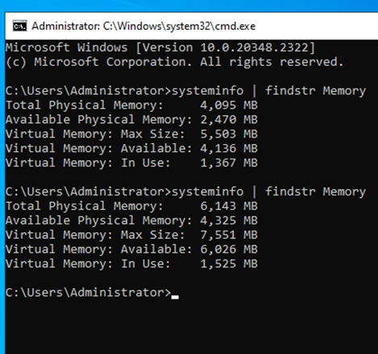
    

ถ้ามีอะไรผิดพลาดไปตอนทำ VM Update, ให้กลับไปที่แท็บ _Manage_. แล้วคลิกปุ่มที่อยู่ติดกับ _Restore_'User ##`_ เพื่อให้ application ของคุณกลับไปในสถานะเดิมที่เรา capture เอาไว้ใน snapshot.

## Takeaways

Key things ที่คุณควรรู้เกี่ยวกับ Nutanix Self Service และ Single VM Blueprints มีอะไรบ้าง?

-   Nutanix Self Service ดำเนินการจัดทำ application และ infrastructure automation บน Prism แบบ native, ช่วยเปลี่ยนกระบวนการ ticketing processes ซับซ้อนที่กินเวลาเป็นอาทิตย์ให้เสร็จเป็น one-click self-service provisioning.
-   มีวิธีการทำ configure และ control ส่วนของ credentials อยู่หลาย methods.
-   ในขณะที่ Multi VM Blueprints สามารถใช้งาน provisioning และจัดการ lifecycle ของแอพแบบ complex, multi-tiered applications ได้, Single VM Blueprints ก็เปิดให้ทางฝั่ง IT สามารถจัดเตรียม Infrastructure-as-a-Service ไปให้ end users ได้ด้วยเช่นกัน.
-   พวก operation แบบ common day two เช่น, snapshots, restoring, cloning, และการทำ updating infrastructure ทุกๆ อย่างสามารถรันโดย end users จากภายใน Self Service ได้โดยตรง.
