# Configuration

# [#](#storage-configuration) Storage Configuration

## [#](#overview) Overview

ในส่วนนี้ เราจะใช้ Prism Central เพื่อทำการกำหนดค่าการจัดเก็บข้อมูล

## [#](#nutanix-aos) Nutanix AOS

Nutanix AOS นำเสนอพื้นที่จัดเก็บข้อมูลให้กับ hypervisor ในลักษณะที่เหมือนกับว่าเป็นการนำเสนอจาก centralized storage array ทั่วไป อย่างไรก็ตาม Nutanix ใช้ Controller VMs (CVMs) ร่วมกับพื้นที่จัดเก็บข้อมูลภายในของแต่ละ node เพื่อให้บริการ shared storage สำหรับ cluster ที่มีความซ้ำซ้อนและทนทาน การรวมกันของทรัพยากรการประมวลผลและ distributed local storage นี้ปัจจุบันเรียกว่า Hyper-converged Infrastructure (HCI)

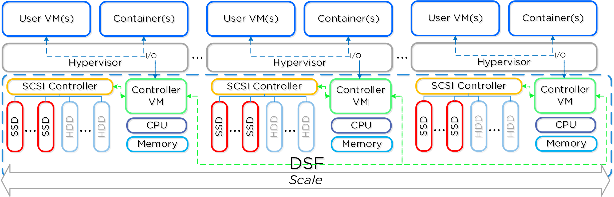

ในฐานะผู้บุกเบิกในพื้นที่ HCI, Nutanix AOS เป็นโซลูชันที่สมบูรณ์แบบ สามารถมอบประสิทธิภาพและความยืดหยุ่นที่จำเป็นสำหรับ [workloads หลากหลายประเภทopen in new window](https://www.nutanix.com/solutions/) รวมถึงฐานข้อมูลระดับองค์กร virtual desktops, Edge locations, Big Data, AI และอื่นๆ

โครงสร้างหลักสองส่วนในการจัดเก็บข้อมูลภายใน AOS ได้แก่ _Storage Pool_ และ _Storage Containers_

_Storage Pool_ คือการรวมกันของดิสก์ฟิสิคัลทั้งหมดภายใน Nutanix cluster ที่กำหนด cluster จัดการการกระจายข้อมูล ดังนั้นจึงไม่จำเป็นต้องมี storage pools อื่น (เช่น LUNs ในสภาพแวดล้อม storage แบบดั้งเดิม) เมื่อมีการเพิ่ม node ใหม่เข้าสู่ cluster ดิสก์จะถูกเพิ่มเข้าสู่ pool โดยอัตโนมัติ และ cluster จะเริ่ม [re-distributing data to the new disksopen in new window](https://www.nutanixbible.com/4c-book-of-aos-storage.html#disk-balancing) เป็น background task

_Storage Containers_ เป็น software-defined logical constructs ที่อนุญาตให้คุณกำหนดนโยบายการจัดเก็บข้อมูลสำหรับกลุ่มของ VMs หรือ vDisks ในแบบฝึกหัดถัดไป คุณจะได้เรียนรู้กระบวนการสร้างและกำหนดค่า Nutanix storage ภายใน Prism Central

Note

หากต้องการเรียนรู้เพิ่มเติมเกี่ยวกับโครงสร้าง AOS เพิ่มเติม เช่น vDisks, extents และ extent groups โปรดดูที่ [this sectionopen in new window](https://www.nutanixbible.com/4c-book-of-aos-dsf.html) ของ Nutanix Bible

## [#](#prism-central-storage-configuration-items) Prism Central Storage Configuration Items

### [#](#configure-storage-containers) Configure Storage Containers

มาใช้ PC เพื่อทำการตั้งค่า container เบื้องต้นกัน

1.  จากเมนู side-bar เลือก **Storage** และในส่วนนั้นคลิกที่ **Storage Container**
    
    Note
    
    หรือคุณสามารถพิมพ์ "Storage Containers" ในช่องค้นหาและเลือก "Storage Container > List"
    
    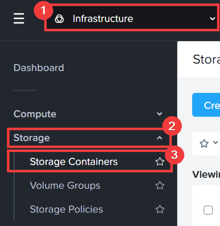
    
2.  คลิก "Create Storage Container"
    
    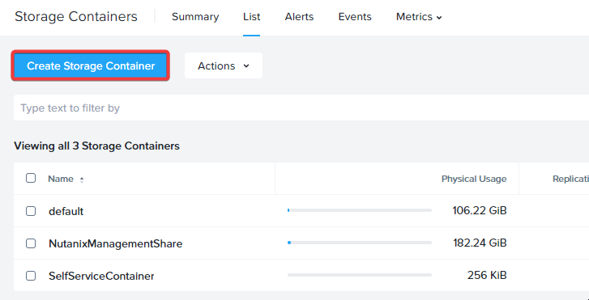
    
3.  กรอกข้อมูลในฟิลด์ต่อไปนี้ แล้วคลิก **Create**
    
    -   **Name** - `Initials`\-Container
    -   เลือก **Advanced Settings**
        -   replication factor ถูกเลือกเป็น 2 แล้ว ซึ่งหมายความว่าจะสร้างข้อมูลสำรอง 2 ชุด
    -   **Reserved Capacity** - 0
    -   **Advertised Capacity** - `500 GiB`
    -   **Compression** ถูกเลือกไว้แล้ว เนื่องจาก container ใหม่มี **Inline Compression** เปิดใช้งานโดยค่าเริ่มต้น
    -   คุณสามารถเก็บค่าที่เหลือเป็นค่าเริ่มต้น แต่หากต้องการ สามารถเปิดใช้งาน capacity deduplications และ Erasure Coding ได้
    
    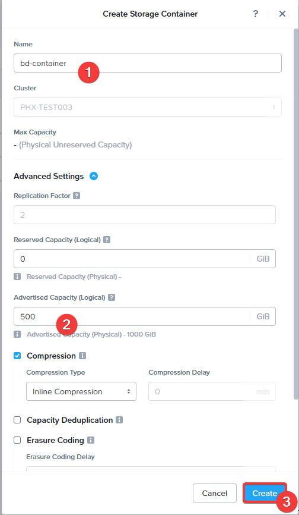
    
4.  storage container พร้อมใช้งานทันทีในทุก node ภายใน cluster
    
    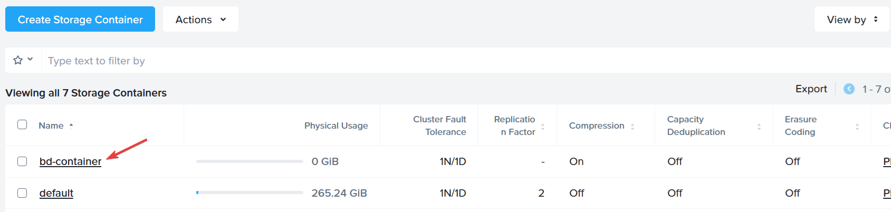
    
    คุณสามารถสร้าง container หลายอันที่มีนโยบายต่างกัน โดยทั้งหมดแชร์ capacity จาก **Storage Pool** ตัวอย่างเช่น คุณอาจต้องการเปิดใช้งาน [deduplicationopen in new window](https://www.nutanixbible.com/4c-book-of-aos-storage.html#elastic-dedupe-engine) สำหรับ storage container ที่ใช้สำหรับ full clone persistent virtual desktops หรืออาจต้องการสร้าง storage container ที่เปิดใช้งาน [erasure codingopen in new window](https://www.nutanixbible.com/4c-book-of-aos-storage.html#erasure-coding) ซึ่งให้การใช้พื้นที่จัดเก็บที่ดีขึ้นสำหรับข้อมูลที่ไม่ได้เข้าถึงมาสักระยะหนึ่ง
    
5.  ถัดไป คลิกที่ **default** storage container เพื่อดูรายละเอียด
    
    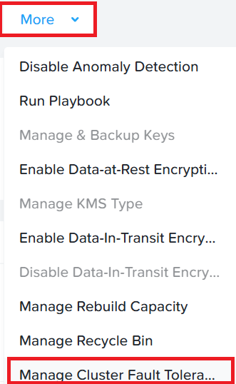
    
6.  คุณสามารถดูข้อมูลทั้งหมดที่เกี่ยวข้องกับ container นี้ในหน้า summary ซึ่งแสดงภาพรวมของคุณสมบัติของ container, สถิติการใช้งานปัจจุบัน, การเพิ่มประสิทธิภาพข้อมูล, ประสิทธิภาพ และการแจ้งเตือนที่เกิดขึ้นบน cluster
    
    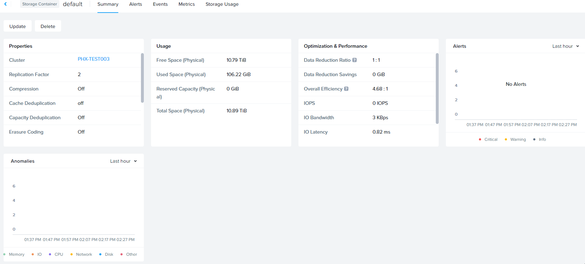
    
7.  คุณสามารถคลิกที่แท็บด้านบนเพื่อดูข้อมูลโดยละเอียด คลิกที่แท็บ **Metrics** เพื่อดู metrics ของ container ในช่วง 24 ชั่วโมงที่ผ่านมา
    
    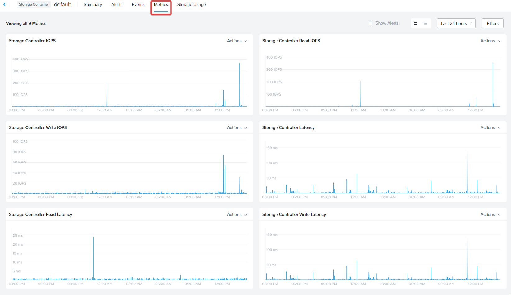
    

### [#](#storage-policies) Storage Policies

แทนที่จะจัดการการกำหนดค่าในระดับ container, Nutanix ปัจจุบันอนุญาตให้ผู้ดูแลระบบตั้งค่า storage policies และนำไปใช้กับ VMs และ Volume groups แต่ละรายการ ทำให้ง่ายต่อการจัดการคุณสมบัติในหลายๆ entities

1.  จากเมนู side-bar เลือก **Compute & Storage** และในส่วนนั้นคลิกที่ **Storage Policies**
    
    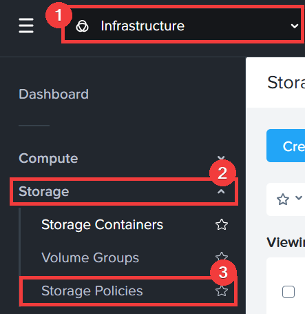
    
2.  มี default storage policy ตั้งค่าไว้แล้วสำหรับผู้ดูแลระบบ หรือสามารถสร้าง custom policy ตามต้องการ คลิกที่ "Default-Storage"
    
    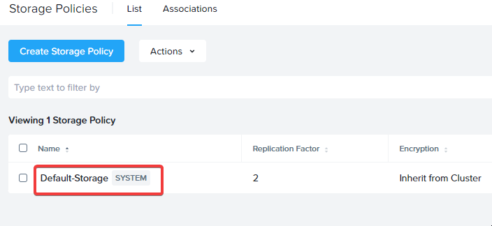
    
3.  ที่นี่คุณสามารถดูค่าที่กำหนดไว้สำหรับนโยบายนี้ ตั้งแต่ replication factor, encryption, compression และ QoS โดย storage policy นี้ผูกกับ category ที่ถูกสร้างขึ้นโดยค่าเริ่มต้นด้วย
    
    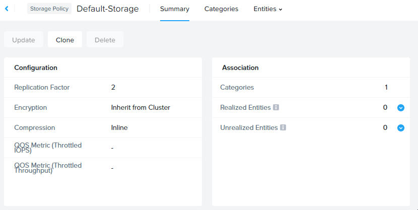
    

Storage policies และนโยบายอื่นๆ ทั่วไป เช่น security, protection ใน Prism Central ใช้ categories เพื่อเชื่อมโยงกับ entities เช่น VMs และ VGs โดย Categories เป็นคู่ key:value ที่สามารถสร้างเพื่อจัดกลุ่ม entities ตามต้องการ แล้วนำนโยบายไปใช้กับพวกมันเพื่อให้ได้การ deploy ที่เหมือนกันและสม่ำเสมอ

## [#](#resiliency-and-redundancy) Resiliency and Redundancy

แพลตฟอร์ม Nutanix ใช้ replication factor (RF) และ checksum เพื่อให้แน่ใจถึงความซ้ำซ้อนและความพร้อมใช้งานของข้อมูลในกรณีที่ node หรือดิสก์ล้มเหลวหรือเสียหาย RF กำหนดจำนวนสำเนาข้อมูลที่จะเก็บรักษา (2 หรือ 3) โดย replication factor 3 เพิ่มการป้องกันข้อมูลอีกชั้นในราคาของพื้นที่จัดเก็บสำหรับสำเนาข้อมูลเพิ่มเติม

สนใจเรียนรู้เกี่ยวกับการทำงานของ RF writes และ reads? ดู [videoopen in new window](https://www.youtube.com/embed/OWhdo81yTpk) ด้านล่าง

<iframe width="640" height="360" src="https://www.youtube.com/embed/OWhdo81yTpk" frameborder="0" allow="accelerometer; autoplay; encrypted-media; gyroscope; picture-in-picture"></iframe>

นโยบาย RF ถูกนำไปใช้ในระดับ per-container

Nutanix clusters ยังสามารถบังคับใช้ [availability domain policiesopen in new window](https://www.nutanixbible.com/4c-book-of-aos-storage.html#availability-domains) ในระดับ Block หรือ Rack เพื่อป้องกันความล้มเหลวของ block หรือ rack

Block Awareness ช่วยให้มั่นใจว่าสำเนาข้อมูลรองจะไม่ถูกเขียนไปยัง node ภายใน physical enclosure เดียวกันกับสำเนาหลัก Block Awareness ช่วยให้สามารถรองรับการสูญเสีย multi-node block โดยไม่เกิดการขาดความพร้อมใช้งานของข้อมูล แนวคิดเดียวกันนี้สามารถนำไปใช้กับ Nutanix cluster ที่ครอบคลุมหลาย rack โดยที่ rack ถูกกำหนดโดยผู้ดูแลระบบ

ข้อกำหนดพื้นฐานสำหรับการทนต่อความผิดพลาดของ rack/block คือต้องมี block อย่างน้อย 3 blocks ใน cluster (สำหรับ RF2) เนื่องจากต้องเก็บ metadata สามสำเนา Rack และ block awareness สามารถรองรับได้พร้อมกับ erasure coding ที่เปิดใช้งาน

ถัดไป มาดูข้อมูล resiliency โดยละเอียดสำหรับ cluster

1.  จากเมนู side-bar เลือก **Hardware** และในส่วนนั้นคลิกที่ **Clusters**
    
    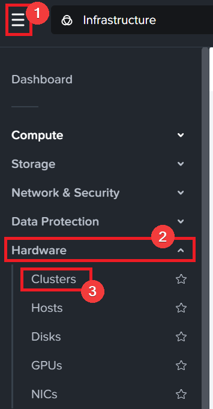
    
2.  คลิกที่ชื่อ cluster ของคุณ
    
    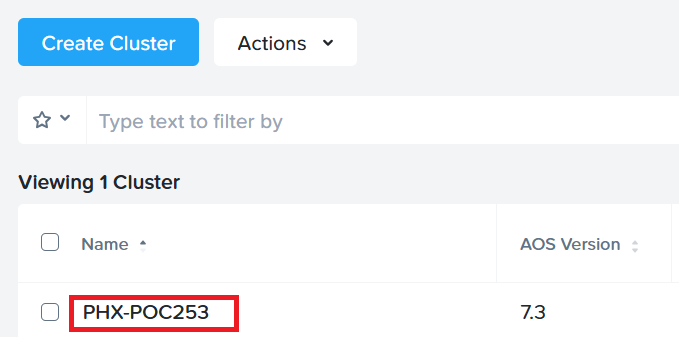
    
3.  ดู widgets ต่างๆ และข้อมูลโดยละเอียดสำหรับ cluster ของคุณ เราจะดูที่ Resiliency widget ดังนั้นคลิกที่ **OK**
    
    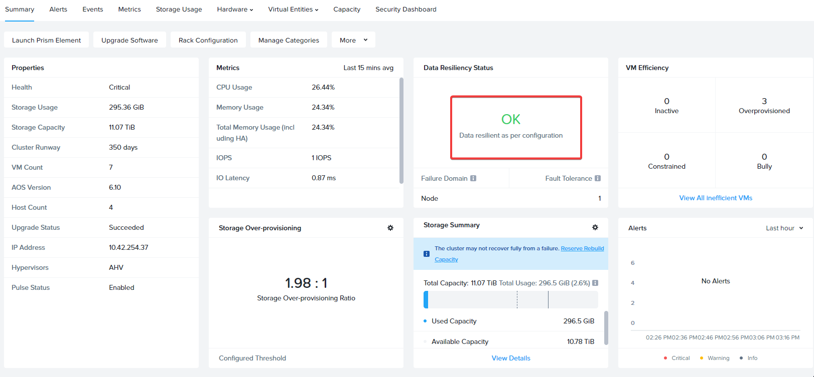
    
    AOS ติดตามจำนวนความล้มเหลวที่สามารถทนได้โดยไม่กระทบต่อ cluster สำหรับบริการและส่วนประกอบแต่ละรายการภายใน availability domain ที่นี่ในระดับ node นี่คือส่วนประกอบที่ AOS ติดตาม บริการแต่ละรายการที่แสดงมีฟังก์ชันเฉพาะใน cluster ตัวอย่างเช่น Zookeeper nodes รักษาข้อมูลการกำหนดค่า (service states, IPs, host information ฯลฯ) สำหรับ cluster
    
    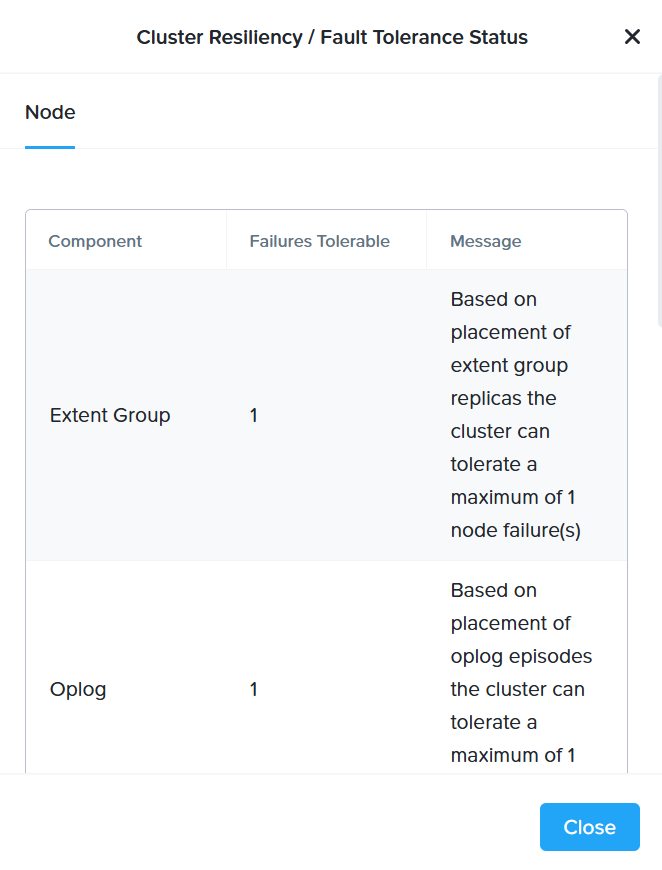
    
4.  สถานะ redundancy ของ cluster สามารถจัดการได้โดยคลิก **More** แล้วคลิก **Manage Cluster Fault Tolerance**
    
    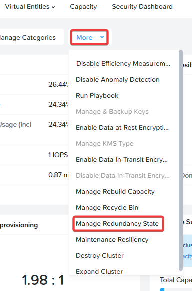
    
    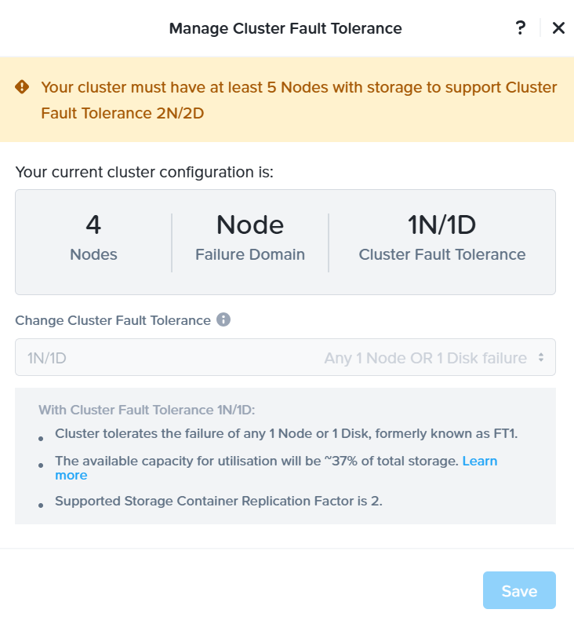
    
    RF2 cluster สามารถอัพเกรดเพื่อรองรับ RF3 (ซึ่งต้องการ node อย่างน้อย 5 nodes) หรือ downgrade เป็น RF1 โดยมีข้อแม้ดังต่อไปนี้:
    

Warning

การเปิดใช้งาน RF1 ไม่รับประกันความพร้อมใช้งานของข้อมูล Nutanix แนะนำให้เปิดใช้งาน RF1 เมื่อ use case หลักของ cluster ของคุณคือการรันแอปพลิเคชันที่ไม่ต้องการ storage resiliency

## [#](#takeaways) Takeaways

-   Nutanix AOS ให้บริการ shared storage ที่ยืดหยุ่นแก่แอปพลิเคชันโดยใช้ค่า replication factor 2 หรือ 3
-   Storage Containers ช่วยให้คุณกำหนดนโยบายการจัดเก็บข้อมูลในระดับ logical container
-   Storage policies ช่วยให้คุณกำหนดนโยบายการจัดเก็บข้อมูลและกำหนดให้กับ entities โดยตรงโดยไม่ต้องพึ่งพา storage containers
