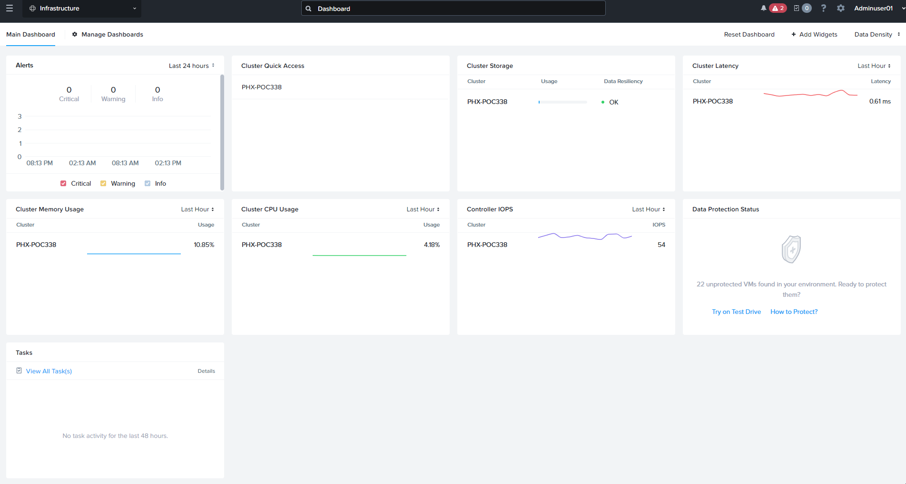
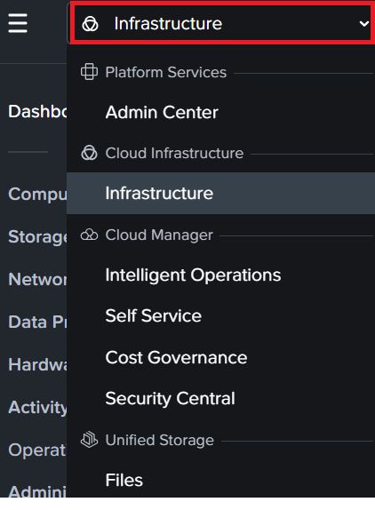
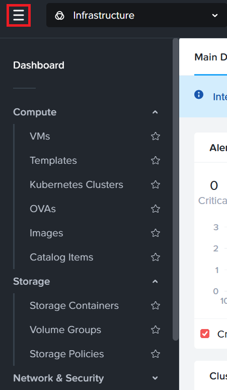
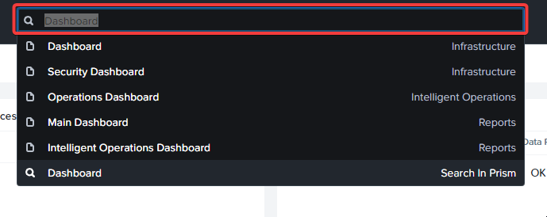
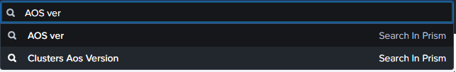

# [#](#technology-overview) Technology Overview

## [#](#overview) Overview

ในส่วนนี้ เราจะแนะนำอินเทอร์เฟซผู้ใช้แบบกราฟิก (GUI) ของ Prism Central (PC) พร้อมทำความคุ้นเคยกับเลย์เอาต์และการนำทางภายในระบบ

## [#](#prism-central) Prism Central

Prism Central คือแพลตฟอร์มการจัดการแบบรวมศูนย์ที่ช่วยให้คุณสามารถบริหารจัดการ Nutanix cluster หลายชุดจากที่เดียว โดยมีแดชบอร์ดกลางสำหรับดูข้อมูล cluster, VM (Virtual Machine), host, disk และ storage พร้อมความสามารถในการ drill-down เพื่อดูรายละเอียดเชิงลึก นอกจากนี้ยังสามารถกำหนดค่า cluster แต่ละชุดจากส่วนกลาง และใช้ single sign-on สำหรับ Prism Element cluster ที่ลงทะเบียนทั้งหมด

เปิดเบราว์เซอร์ Chrome หรือ Firefox แล้วเข้าสู่ระบบ Nutanix Prism GUI โดยใช้ IP ที่ได้รับ

1.  พิมพ์ `PC-IP-ADDRESS` ในแท็บเบราว์เซอร์ใหม่
    
2.  เข้าสู่ระบบ Prism Central ตรวจสอบให้แน่ใจว่าหน้าจอเข้าสู่ระบบแสดงข้อความ **Login with your Company ID**
    
    -   **username** - `<PC username> จะเป็นชื่อในรูปแบบ adminuser##`
    -   **password** - `<PC password ที่ได้รับ>`
    
    
    
3.  หลังจากเข้าสู่ระบบ PC แล้ว ให้ทำความคุ้นเคยกับ GUI นี่คือแดชบอร์ดหลักของ PC ซึ่งแสดงภาพรวมของ cluster ทั้งหมดที่ลงทะเบียนกับ PC instance นี้
    
    
    
4.  ตรวจสอบหน้าจอ widgets และระบุรายการต่อไปนี้:
    
    -   Alerts
    -   Cluster Quick Access
    -   Cluster Storage
    -   Cluster Latency
    -   Cluster Memory Usage
    -   Cluster CPU Usage
    -   Controller IOPS
    -   Tasks
5.  ถัดไป ให้ดูที่ส่วน App Switcher ที่มุมบนซ้ายของ Prism Central
    
    หมายเหตุ
    
    คุณสามารถใช้ App Switcher เพื่อนำทางและเข้าถึงความสามารถต่างๆ ของ Nutanix Cloud Platform ที่เปิดใช้งานผ่าน Prism Central ได้อย่างรวดเร็ว
    
    
    
6.  สำหรับแต่ละส่วน ให้คลิกที่ hamburger menu เพื่อดูตัวเลือกต่างๆ ตัวอย่างเช่น สำหรับ infrastructure คุณสามารถเข้าถึงทุกอย่างที่เกี่ยวข้องกับ infrastructure ได้แก่:
    
    -   Compute
    -   Network and Security
    -   Data Protection
    -   Hardware
    -   Activity
    -   Operations
    -   Administration
    
    
    

เราจะพูดถึงบางส่วนเหล่านี้ในระหว่าง bootcamp นี้ แต่คุณสามารถเรียกดูและคลิกสำรวจได้ตามต้องการ

7.  วิธีที่ง่ายในการนำทางใน PC คือการใช้ฟังก์ชันค้นหา คุณสามารถใช้การค้นหาเพื่อเข้าถึง entity แต่ละรายการหรือหน้าการกำหนดค่าทั้งหน้า และยังรองรับการใช้ regular expression ในการค้นหาด้วย
    
    
    
    ตัวอย่างเช่น หากต้องการดูว่า AOS เวอร์ชันใดกำลังทำงานอยู่บน cluster ของคุณ เพียงพิมพ์ AOS ver แล้วระบบจะแสดงผลลัพธ์ให้
    
    
    

## [#](#takeaways) Takeaways

-   Prism Central คือแผงควบคุมหลักที่คุณใช้โต้ตอบและใช้งาน Nutanix Cloud Platform
-   มีอินเทอร์เฟซที่ใช้งานง่ายและมีประสิทธิภาพ พร้อมฟังก์ชันค้นหาที่ทรงพลัง ช่วยให้งานของผู้ดูแลระบบสะดวกยิ่งขึ้น
